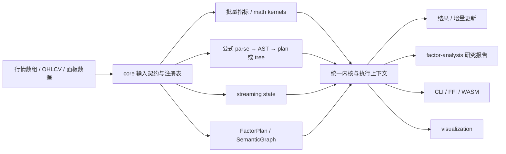

# Finkit 架构审查与重构方案

> 审查基线：`main`，HEAD `496763b7`（2026-10-08，workspace 版本 `0.2.0`）。
> 审查日期：2026-10-10。本文根据当前代码、仓库文档、只读工程门禁和选定链路测试编写；不把旧版路线图中的未完成事项直接当作当前状态。

## 结论摘要

Finkit 已是具备实际功能的 Rust-first 量化计算引擎，不是需要推倒重写的原型。指标计算、公式解析与执行、流式更新、因子图/研究流程、CLI 和多语言接口都已落地。当前更适合做**语义统一、执行路径收敛、产品边界说明和交付闭环**，不适合做全盘重写。

| 问题 | 判断 |
| --- | --- |
| 核心计算能力是否已实现？ | **主体已实现；不能称为所有产品面都完成。** Rust 核心能力丰富。iOS/Android 有意只覆盖 15/78 个指标；绑定覆盖、平台发布和注册表漂移检查也有不同成熟度。 |
| 主体链路是否贯通？ | **主要 Rust 链路贯通，并有专项测试支撑。** 批量指标、公式、流式、统一计划/因子研究和 CLI 均可执行。语言绑定覆盖核心 indicator API，但不能据此推断所有语言的所有公式/研究能力完全一致。 |
| 统一运行时是否已经成为唯一生产路径？ | **还没有。** `FormulaEngine` 默认模式仍为 `Tree`；`Plan` 可显式启用，但有一组 tree-only 入口会明确报 `BackendUnsupported`。统一执行图和 `UnifiedRuntime` 已投入使用，但尚未覆盖所有公式入口，也没有把各层缓存收敛为一个缓存。 |
| 最不合理之处是什么？ | 文档仍有关键路径描述与源码不符；若把“统一运行时”理解成全部 API 已统一，会高估当前覆盖。数值边界策略仍需分域讲清，并继续减少多份实现。 |

**判断标准**：以当前源码和可执行合同为准；“代码存在”“有测试覆盖”“跨平台构建成功”“已发布给用户”是四种不同状态。项目当前的产品边界也明确不含回测和选股引擎，不能把它们当作遗漏功能。

## 项目功能与模块架构

### Workspace 与职责

Workspace 有 14 个成员，整体以 `core` 为计算与语义中心，外层 crate 提供研究、渲染、命令行和不同语言的交付面。

| 部分 | 职责 | 主要实现 |
| --- | --- | --- |
| `core` / `finkit` | 技术指标、数学/SIMD、公式、流式、特征工程、因子/组合图、数据契约、执行计划、风险与收益基础能力 | `core/src/indicators/`、`math/`、`formula/`、`streaming/`、`features/`、`semantic_graph.rs`、`unified_runtime.rs` |
| `factor-analysis` | 面板型因子研究、准备、IC/分组分析、验证、组合表现和报告；复用 core 算法 | `factor-analysis/src/prepare.rs`、`executor.rs`、`analysis.rs`、`validation.rs`、`report.rs` 等 |
| `visualization` | 图表场景、布局、视口、交互与 SVG/PNG/HTML/JSON/WebGL 等渲染适配 | `visualization/src/` |
| `cli` | CSV 输入、指标/公式/流式/图表命令、Schema 与 factor-study 命令 | `cli/src/main.rs`、`csv_io.rs`、`bin/` |
| `ffi/ffi-common` 与语言绑定 | C ABI、错误/内存契约、注册表和 Python、Node、Go、Java、.NET、iOS、Android 适配 | `ffi/*-binding/` |
| `wasm` | 浏览器及 Node 的 WASM 适配 | `wasm/src/` |

`core` 内部按 Rust module 分区，公开 API 仍主要由一个 crate 提供。它同时承载数值内核、公式语言、流式状态、研究构件和运行时；这是复用和统一语义的优势，也让 crate 级编译边界、依赖方向和 feature 组合较复杂。

### 主体数据流

公式核心流程为 source → 方言/语法解析 → AST → 参数/自定义公式展开 → `FormulaComputePlan` / `FormulaHotPlan` → `UnifiedExecutor`；Tree interpreter 仍保留为默认/参考执行路径。流式指标在每根 bar 更新状态，`FormingBar` 管理未收盘 bar 的回滚纪律。研究流程把时间戳、资产、因子、价格和研究配置组装为 `FactorStudyRequest`，执行后产出分组/表现分析及报告。

## 实现成熟度与贯通性

| 链路/能力 | 当前状态 | 证据与边界 |
| --- | --- | --- |
| 批量指标与数值核 | 已实现，覆盖面广 | indicator registry、TA-Lib golden、数学内核和批量 API 均在仓库中；执行语义需继续统一。 |
| 公式 parse → evaluate | 已贯通 | Tree 与 Plan 两条路径都存在；Plan 对一部分 API/操作仍不支持，明确失败，不会静默退回 Tree。默认仍是 Tree。 |
| batch ↔ streaming | 主链路贯通 | `runtime_convergence` 覆盖 batch/stream parity、注册表类别和执行一致性。不是每个批量指标都代表每个绑定均有相同流式 API。 |
| 因子图 / 统一运行时 / DirtyRange | 贯通且有安全回退 | 有 full/range 执行、计划缓存、DirtyRange 测试；增量能力采用保守能力合同，不具备证明时回退完整执行。 |
| Factor Research | 研究主流程已贯通 | `factor-analysis` 有从请求、准备、执行、统计、验证到报告的端到端测试；未来数据不回写历史的研究不变量测试通过。它不是回测/选股引擎。 |
| CLI | 可运行的交付面 | indicator、formula、streaming、chart、schema、factor-study 等命令已落地；本次运行 CLI CSV/Schema 测试。 |
| 指标绑定 | 六种绑定覆盖登记的 78/78 指标 | C/Python/Node/Go/Java/.NET 的指标 surface gate 为 78/78。该数值只代表登记的 indicator API，不代表所有核心 API、方言或研究工作流完全 parity。 |
| 移动绑定 | 有意缩小的子集 | iOS/Android 均 15/78；仓库将其标为 deferred/移动端 ABI 子集，除非产品目标改变，不应当作当前阻塞项。 |
| 发布与安装 | 状态分层 | 源码存在、CI 候选产物和公开注册表发行并不等价；README 的 v0.1.15 发行说明与 workspace `0.2.0` 开发基线应并列理解。 |

## 主要不合理点与风险

按正确性、产品承诺和维护成本排序。此处列的是当前审查关注点，不代表每个点都需要立即改代码。

### P0：公式主路径的文档和实际默认模式有冲突

`FormulaExecutionMode` 的默认值为 `Tree`，并有 `tree_is_the_default` 测试；`Plan` 是显式模式。Plan 模式下，一组入口会返回 `BackendUnsupported`，这是一项明确的覆盖边界。可是 `docs/architecture/formula-engine.md` 仍写着“生产执行通过 compiled-plan path”，其缓存一节也仍描述 LRU，与当前引擎的多组有界 FIFO 缓存不符。

**影响**：使用者会误判生产默认路径、Plan 的覆盖率和性能特征；未来把 Plan 设为默认也会成为意外的行为/兼容变更。建议先更新架构图、默认值、tree-only 表、cache 实现与 feature 冻结说明，再以实测的覆盖矩阵讨论切换。

### P1：跨数值路径的语义需要形成一份清楚、按领域划分的合同

最近已把 ADX/DMI 与 canonical state/kernel 对齐，固定了 TA-Lib 零判定带宽，并区分 TA-Lib 指标内核的 `TA_IS_ZERO_BANDWIDTH` 与公式/特征等领域的 `NUMERIC_EPSILON`。但旧审计记录指出同仓库对 NaN 有传播、拒绝、忽略等多种策略；多处同源实现和剩余指标的边界行为仍需以当前代码逐项核对。不要把这些不同领域的策略机械统一成一个 epsilon 或一个 NaN 处理规则。

**影响**：同样的缺失行情可能在不同指标族得出不同结果；如果绑定也各自处理，就会出现跨 API 漂移。需要每个数据入口和 kernel 家族都能指向明确策略及其 golden 测试。

### P1：统一 Runtime 已有实质链路，但还不是所有入口的 SSOT

Formula、factor/composite graph 和 `UnifiedRuntime` 可复用计划与执行上下文；引擎中的 semantic plan、hot plan、bytecode cache 均已设为有界（当前容量 1024）。但是 `RuntimeContext::ArtifactCache` 目前主要由 unified runtime 使用，公式引擎仍保留自己的缓存。它们现在有界，但 key、淘汰、指标和生命周期并非完全共享。

**影响**：相同声明在不同层有独立的复用与统计行为；宣称“一个缓存/一个 Runtime”会超出实际。除非 profiling 证明共享收益，重构应先统一合同与观测，不应仅为名义上的 SSOT 让不同 key/lifetime 规则硬塞进一个容器。

### P2：`core` 模块职责很全，crate 边界偏粗

`core` 在一个 crate 内包含计算核、公式语言、流式、特征工程、语义图和 runtime；`factor-analysis` 依赖 `core` 的 std、serde、formula、indicators-all 等 feature 组合。按模块拆文件已减少几个最大文件，但一个 crate 仍有多个产品层职责和复杂的 feature unification。

**影响**：最明显的成本是编译配置和依赖关系难以局部验证，而非单纯行数。建议保持一个稳定 public facade，优先明确内部层级/依赖规则和 standalone feature 合同；只有真实的独立发布、构建或安全边界需求再拆 crate。

### P2：绑定“覆盖率”与“维护/发布承诺”是两套指标

78/78 是指标表覆盖，不是全 API parity。Python/Node 是 active drift-check tier；其他语言仍有不同的同步/发行成熟度。候选包也不自动等于公开 registry package。

**影响**：营销或 roadmap 若只引用 78/78，容易让用户误以为全部功能和平台均已对等。保持层级矩阵，并为每种绑定明确“指标 surface、公式面、研究面、平台验证、发行状态”。

### P3：大文件拆分已做，但规模棘轮不是模块边界设计

最新提交将四个大文件按功能族拆分，并把 Python binding 拆为多个文件；文件预算门禁可防止已登记的大文件继续增大。它解决可读性和评审风险，但并没有消除跨层依赖或同源重复实现。继续按“低行数”机械拆分会增加导航和共享 helper 成本。

## 分阶段重构方案

总体原则：**先固化可观察合同，再迁移实现；保持 public API 兼容，除非版本规划明确批准 breaking change；每阶段小步提交、可回滚，并由已有 gate 持有结果。**

### 阶段 0：建立可信现状矩阵

1. 以此文档的基线 commit 为起点，生成核心入口矩阵：indicator、formula dialect/API、streaming、factor/research、CLI、各绑定、发布产物。
2. 对矩阵逐项标注“可编译 / 专项测试 / parity / CI target / published”，禁止把这些状态混成一个完成度百分比。
3. 将未复现的旧审计结论标注为待核验，而不是自动视为当前缺陷。

**完成条件**：矩阵有对应源码入口、合同测试/门禁和发行状态；docs 之间没有相互矛盾的默认路径说明。

### 阶段 1：数值语义与输入边界统一

1. 以领域合同明确 NaN/Infinity：入口拒绝还是 kernel 传播/忽略；缺失数据场景和 fallback 都必须具名。
2. 继续把重复热点指标指向 canonical kernel；batch、streaming、SIMD、FFI 保持同一 numerical contract。
3. 对 TA-Lib 对齐的精确零语义与公式/因子中的数值 epsilon 分域治理；不要全仓文本替换。
4. 每项语义变更先加入极端值/NaN/平坦行情 golden，再改实现；输出长度、warm-up、时间方向也作为合同。

**完成条件**：每个保留的重复实现有理由和差分测试；每个 epsilon/NaN 策略能从代码追溯到公开合同。

### 阶段 2：收敛公式执行路径

1. 枚举 `FormulaEngine` 的所有 source-level 入口、方言、参数、multi-output、append/range/last 与 effects，标注 Tree、Plan、unsupported。
2. 为 Plan 缺失 kernel 的操作建立优先级；先补常见、稳定的纯数值操作，不把有状态绘图/上下文隐式函数强行转成数值 kernel。
3. 继续对 Tree reference 与 Plan production 候选做 differential tests，并补绝对性质测试（finite count、恒等式、warm-up、错误语义）。
4. 完成覆盖与兼容评估之前，维持 Tree 默认与 Plan 显式选择；若未来要更改默认，单独做版本/绑定迁移决策。
5. 统一公开文档中的真实默认、frozen JIT/`eval_simd`、Plan 限制和缓存政策。

**完成条件**：公式入口矩阵无未标记空白；所有计划支持项通过差分及绝对性质 gate；unsupported 项有稳定错误和迁移说明。

### 阶段 3：运行时与缓存合同

1. 先统一缓存容量、key 语义、淘汰策略、统计字段、清理 API 和线程共享要求的文档/API 合同。
2. 用长时、多公式、多租户负载量化各缓存占用和命中率，再决定是否把公式引擎缓存迁到 `ArtifactCache`，或保留引擎本地缓存。
3. 确保 cache clear 覆盖所有派生计划；计划失败不污染 cache；并发共享如果不是目标，清楚记录 `RefCell` 的线程限制。
4. 只有完整依赖链证明增量安全时才执行 DirtyRange；继续把未知、cross-sectional、dynamic-lookback 任务保守回退到 full run。

**完成条件**：缓存有硬容量上限、可观测命中/驱逐且清理合同完整；增量结果和全量重算逐值一致。

### 阶段 4：边界解耦与依赖治理

1. 在现有文件拆分基础上绘制内部层级：数据契约 → kernels → plans/runtime → domain workflows → adapters。
2. 增加依赖方向 gate，禁止 kernel 反向依赖 CLI、FFI、展示层；减少高层 crate 对 `indicators-all` 的隐式需求。
3. 根据真实构建耗时与 feature-tree 结果，先拆内部 facade/feature 配置，再评估是否需要将稳定子系统抽成独立 crate。
4. 将新增职责拆分优先于纯文件切片；维持文件规模棘轮，但允许合理的大型目录模块和共享 prelude。

**完成条件**：独立 crate 构建与 workspace 构建使用相同明确 feature contract；层间依赖可由脚本验证。

### 阶段 5：绑定与发行闭环

1. 明确 active 与 deferred 语言层级；每个绑定文档都区分指标 surface 与完整 API parity。
2. 对 Python/Node 维持生成源漂移和运行时 smoke gates；对其他绑定保留 standalone compile、错误/内存合同和发布候选检查。
3. iOS/Android 保持 15/78 子集，除非产品目标确认要扩大；如扩容，先评估 ABI、二进制体积及稳定性预算。
4. 将发行版本、workspace 开发版、CI 候选和公开 registry 状态分别维护；发布说明以实际产物及 clean consumer install 为准。

**完成条件**：每个宣称支持的目标有真实构建/运行/安装验证；未发布目标在文档中明确写作候选或源码支持。

## 本次验证记录

以下是本审查实际执行的核验；不等同于全平台 release gate。

| 核验 | 结果 |
| --- | --- |
| `formula_execution_mode`、`formula_input_bounds`、`runtime_convergence` | 36/36 通过；确认 Tree 默认、Plan unsupported 明确失败、输入边界和增量/全量合同。 |
| `cargo test -p finkit-factor-analysis --locked` | 52/52 测试通过，包括完整研究流程和 point-in-time 不变量。 |
| `cargo test -p finkit-cli --tests --locked` | 15/15 通过，包括 CSV 与机器可读 schema CLI。 |
| `audit_binding_parity.py --check` | 通过基线；C/Python/Node/Go/Java/.NET 指标 surface 78/78；iOS/Android 15/78。 |
| `check_binding_feature_contract.py` | 9 个绑定 feature contract 全通过。Windows 默认代码页起初导致子进程解码错误；以 UTF-8 环境重跑通过。 |
| Rust 源可达性 | 545 个 tracked source files 全部 module-reachable。 |
| SSOT 文档生成检查、文档链接检查、unused macros、file size budget | 均通过；84 个 Markdown 链接检查通过，555 个源文件在规模预算内（42 个在 1500 行默认上限以上、由基线棘轮约束）。 |

这些专项验证不表示 macOS/Android/iOS 每个目标已在本机重建，也不代替完整 workspace/release gate。构建过程中出现一次 Windows 增量锁文件清理 `os error 5` 警告，相关专项测试仍正常结束。

## 暂定决策与需确认项

为使本方案可执行，本文按仓库已有约定采用以下暂定决策：

1. 不引入回测/选股产品面，不把 iOS/Android 补到 78 项列为本轮重构前置条件。
2. 保持现有公共 API 与 Tree 默认行为；Plan 默认化必须等待覆盖、数值 parity 与版本迁移评估。
3. 优先修正文档/合同和高风险数值不一致，再考虑 crate 级拆分；不以行数最少为目标。

若这些既有约定已改变，优先需要确认的是：**是否希望把 Plan 设为下一发行版默认公式后端，以及是否要把 iOS/Android 的 15/78 子集提升为本轮交付目标。**这两项会明显改变阶段顺序和兼容/发布范围。

## 相关现有资料

- [架构总览](architecture/overview.md)
- [公式运行时合同](formula-runtime-contract.md)
- [语言绑定与发行状态](language-bindings.md)
- [Factor Research 架构](factor-research-architecture.md)
- [V5 架构与重构总纲及落地记录](FINKIT_ARCHITECTURE_AND_REFACTOR_PLAN_V5.md)
