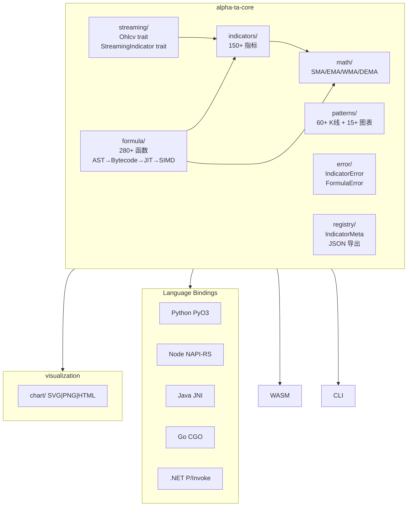

# AlphaTA (AlphaTA) 工业级优化改进 — PRD

## 目录

- [关键假设](#关键假设)
- [产品概述](#1-产品概述)
- [目标用户](#目标用户)
- [用户痛点](#用户痛点)
- [竞品分析](#竞品分析)
- [API 设计](#2-api-设计)
- [类型定义](#3-类型定义)
- [示例用法](#4-示例用法)
- [架构图](#架构图)
- [兼容性](#5-兼容性)
- [发布策略](#6-发布策略)
- [非功能需求](#非功能需求)

## 关键假设

1. **现有 API 向后兼容**：流式 API 作为新增层叠加在现有批量 API 之上，不破坏已有用户的代码
2. **Clippy 警告已明确**：`.trae/specs/fix-formula-clippy-warnings/` 中的清单项即为全部待修复警告
3. **性能基线可测量**：项目已有 Criterion 基准测试框架（`core/benches/formula_bench.rs`），可直接扩展
4. **公式引擎 no_std 不可行**：公式引擎依赖 `pest`/`serde_json`/`rayon`，保持 `std` 依赖；仅核心指标+数学模块支持 `no_std`
5. **黄金测试数据可生成**：可通过 Python 脚本调用 TA-Lib / pandas-ta 生成参考数据 CSV，若未安装 TA-Lib 则使用内置参考数据

## 1. 产品概述

AlphaTA（AlphaTA）是一个高性能金融技术分析 Rust 库，包含 150+ 技术指标、60+ K线形态、15+ 图表形态、通达信兼容公式引擎和 K线可视化。本次改进目标是将其从「功能完整的原型」升级为「工业级生产库」，对标 Kand、VectorTA、quantedge-ta 等优秀开源项目。

### 目标用户

| 用户画像 | 核心需求 | 使用场景 |
|---------|---------|--------|
| **量化交易开发者** | 高性能指标计算、流式更新 | 回测系统、实盘信号生成 |
| **金融数据分析师** | 易用的 Python/Node API | 数据研究、策略分析 |
| **HFT 系统开发者** | 微秒级延迟、零分配 | 实时行情处理、交易执行 |
| **通达信用户** | 公式兼容性 | 通达信公式迁移、自定义指标 |

### 用户痛点

1. **TA-Lib 安装困难**：编译 C 依赖复杂，Windows 上尤其困难；用户需要开箱即用的纯 Rust 替代
2. **Python GIL 性能瓶颈**：pandas-ta 在大规模数据上性能严重不足；用户需要原生多线程加速
3. **缺乏实时流式支持**：现有 TA 库多为批量计算，无法高效处理逐笔 tick 更新；量化开发者需要 O(1) 增量更新
4. **数值正确性不可验证**：缺乏对标 TA-Lib 的黄金测试，用户无法确信计算结果正确

### 竞品分析

| 竞品 | 核心优势 | AlphaTA 差距 | 借鉴设计 |
|------|---------|--------|--------|
| [Kand](https://github.com/rust-ta/kand) (535★) | 现代化 TA-Lib 替代，多线程 | 缺少流式 API | 扩展指标集设计 |
| [VectorTA](https://github.com/VectorAlpha-dev/VectorTA) | 340+ 指标，SIMD/CUDA | SIMD 不完整 | 注册表驱动分发、SIMD 架构 |
| [quantedge-ta](https://github.com/dluksza/quantedge-ta) | O(1) 流式更新，收敛语义 | 无流式支持 | Ohlcv trait、convergence() API、repaint 语义 |
| [RUST-TA](https://github.com/Independent-AI-Labs/RUST-TA) | 零拷贝，no_std，proptest | 缺少 proptest | StreamingIndicator trait、属性测试、黄金测试 |
| [CentaurTI](https://github.com/chironmind/RustTI) (41★) | 指标注册表，CI 门禁 | CI 有缺陷 | indicator_registry.json、阻塞式 CI 门禁 |

**定位**：AlphaTA 在通达信公式引擎和 K线可视化方面领先所有竞品。改进后在指标覆盖度、公式引擎、可视化三个维度保持领先，同时在流式 API、测试体系、CI 质量方面追平竞品。

## 2. API 设计

### 流式指标 Trait（借鉴 quantedge-ta Ohlcv trait + RUST-TA StreamingIndicator）
```rust
pub trait Ohlcv {
    fn open(&self) -> f64;
    fn high(&self) -> f64;
    fn low(&self) -> f64;
    fn close(&self) -> f64;
    fn volume(&self) -> f64;
    fn timestamp(&self) -> i64;
}

pub trait StreamingIndicator {
    type Config;
    type Output;
    fn new(config: Self::Config) -> Self;
    fn update(&mut self, bar: &dyn Ohlcv) -> Option<Self::Output>;
    fn convergence(&self) -> usize;
    fn reset(&mut self);
}
```

### 错误类型（借鉴 Effective Rust 领域错误分类最佳实践）
```rust
pub enum IndicatorError {
    InsufficientData { required: usize, actual: usize },
    InvalidParameter { param: &'static str, reason: String },
    NumericOverflow { indicator: &'static str, index: usize },
}

pub enum FormulaError {
    Parse { line: usize, col: usize, message: String },
    UndefinedFunction { name: String },
    TypeMismatch { expected: String, actual: String },
}
```

### 指标元信息（借鉴 CentaurTI indicator_registry.json）
```rust
pub trait IndicatorMeta {
    const NAME: &'static str;
    const CATEGORY: IndicatorCategory;
    const PARAMS: &'static [ParamSpec];
}
```

## 3. 类型定义

- `OhlcvBar`: 标准化 OHLCV 数据结构（实现 `Ohlcv` trait）
- `StreamingSma`, `StreamingEma`, `StreamingRsi` 等：流式指标结构体
- `IndicatorRegistry`: 运行时指标注册表（支持名称查询）
- `IndicatorError`, `FormulaError`, `FfiError`: 领域错误类型

## 4. 示例用法

```rust
use AlphaTA::streaming::{StreamingSma, StreamingIndicator, SmaConfig};
use AlphaTA::OhlcvBar;

let mut sma = StreamingSma::new(SmaConfig { period: 14 });
for bar in market_data {
    if let Some(value) = sma.update(&bar) {
        println!("SMA(14) = {:.4}", value);
    }
}
assert_eq!(sma.convergence(), 14);
```

## 架构图



## 5. 兼容性

- Rust: MSRV 1.75+
- 平台: Linux / macOS / Windows / WASM
- `no_std`: 核心指标 + 数学模块（feature-gated）
- FFI: Python 3.9+, Node.js 18+, Java 11+, Go 1.21+, .NET 6+

## 6. 发布策略

- crates.io: `alpha-ta-core` 0.4.0（含流式 API + 新错误类型）
- PyPI: `AlphaTA` via maturin
- npm: `@AlphaTA/core` via napi-rs
- 版本规则: SemVer，流式 API 作为 0.4.0 新增功能

## 非功能需求

| 维度 | 目标 | 量化指标 |
|------|------|--------|
| 性能 | 流式 tick 延迟 | < 1μs/tick（主要指标） |
| 性能 | 公式引擎 bytecode | ≥ 60% native speed |
| 性能 | 公式引擎 SIMD | ≥ 80% native speed |
| 测试 | 单元测试覆盖率 | ≥ 80% |
| 测试 | 黄金测试容差 | ≤ 1e-8 vs TA-Lib |
| 质量 | Clippy 警告 | 0 警告（-D warnings） |
| 质量 | 文档一致性 | 100% API 文档匹配实现 |

<!-- AUTO-SYNCED STORIES SUMMARY (do not edit manually) -->
## Stories Summary

| ID | Title | Type | Priority | Status |
|----|-------|------|----------|--------|
| TASK-001 | 修复所有 Clippy 警告并加固 CI 门禁 | refactor | 0 | Done |
| TASK-002 | 文档一致性修复与占位符替换 | docs | 0 | Done |
| TASK-003 | 定义 Ohlcv trait 和 StreamingIndicator trait 体系 | backend | 1 | Done |
| TASK-004 | 工业级错误类型重构 | refactor | 1 | Done |
| TASK-005 | 核心指标流式实现（SMA/EMA/RSI/MACD/BOLL/ATR） | backend | 1 | Done |
| TASK-006 | 属性测试框架 + 核心不变量验证 | test | 2 | Done |
| TASK-007 | 黄金测试体系（vs TA-Lib 参考输出） | test | 2 | Done |
| TASK-008 | 指标注册表 + JSON 导出 | backend | 2 | Done |
| TASK-009 | SIMD 完善与基准测试扩展 | backend | 3 | Done |
| TASK-010 | 公式引擎零拷贝完成与性能验证 | backend | 3 | Done |
| TASK-011 | 发布基础设施与文档完善 | docs | 3 | Done |
| TASK-013 | TA-Lib 对比基准测试套件 | test | 4 | Done |
| TASK-014 | 批量指标 SIMD 向量化深度优化 | backend | 5 | Done |
| TASK-015 | 公式引擎执行开销优化 | backend | 6 | Done |
| TASK-016 | 流式指标微优化 | backend | 7 | Done |
| TASK-017 | 全面性能基准测试报告与结果保存 | docs | 8 | Done |
| TASK-018 | TA-Lib Overlap 缺失函数补全（MA/MAVP/SAREXT/TRIMA） | backend | 9 | Done |
| TASK-019 | TA-Lib Momentum 缺失函数补全（11个） | backend | 10 | Done |
| TASK-020 | TA-Lib 缺失蜡烛图形态补全（10个 CDL） | backend | 11 | Done |
| TASK-021 | Statistics VAR 函数 + 公式引擎注册 | backend | 12 | Done |
| TASK-022 | 国内核心指标实现（KDJ/BIAS/PSY/VR/CR/DPO） | backend | 13 | Done |
| TASK-023 | 国内扩展指标实现（AR/BR/DMA/ENE/EXPMA） | backend | 14 | Done |
| TASK-024 | 国际知名趋势指标（HMA/ALMA/McGinley/ZLEMA/VIDYA/VWMA） | backend | 15 | Done |
| TASK-025 | 国际知名动量/振荡指标（AO/Fisher/TSI/Coppock/KST/STC/CHOP） | backend | 16 | Done |
| TASK-026 | 国际知名成交量/资金流指标（CMF/Force/EOM/KVO/NVI/PVI/PVT） | backend | 17 | Done |
| TASK-027 | 波动率扩展指标（Mass Index/Ulcer Index/RVI） | backend | 18 | Done |
| TASK-028 | 新增指标流式版本（KDJ/BIAS/HMA/CMF/Fisher 等） | backend | 19 | Done |
| TASK-029 | Heikin-Ashi 和 ZigZag 工具函数 | backend | 20 | Done |
| TASK-030 | 新增指标性能基准测试与优化 | test | 21 | Done |
| TASK-031 | 公式引擎新增指标注册与FFI绑定更新 | backend | 22 | Done |
| TASK-032 | NaN→0 系统性偏差修复（工业级质量） | backend | 23 | Done |
| TASK-033 | ZigZag 除零修复与 Edge Case 加固 | backend | 24 | Done |
| TASK-034 | O(n×period)→O(n) 滑动窗口优化 | backend | 25 | Done |
| TASK-035 | 堆分配减少与内存优化 | backend | 26 | Done |
| TASK-036 | 完整性能基准测试运行与结果保存 | test | 27 | Done |
| TASK-037 | 一键构建脚本（build.ps1 + build.sh） | backend | 28 | Done |
| TASK-038 | FFI 构建问题修复 | backend | 29 | Done |
| TASK-039 | README 与文档全面更新 | docs | 30 | Done |
| TASK-040 | rolling_max/rolling_min O(n) 单调队列优化 | backend | 31 | Done |
| TASK-041 | WMA O(n) 递推算法优化 | backend | 32 | Done |
| TASK-042 | DI/ADX 链路 O(n) Wilder 平滑修复 | backend | 33 | Done |
| TASK-043 | CCI/CMO/MFI/ULTOSC 滑动窗口优化 | backend | 34 | Done |
| TASK-044 | AROON O(n) 单调队列优化 | backend | 35 | Done |
| TASK-045 | 公式引擎 collect 消除与 SIMD 路径优化 | backend | 36 | Done |
| TASK-046 | MACD/DEMA/TEMA 中间 Vec 消除与 ema_in_place | backend | 37 | Done |
| TASK-047 | BBANDS 单遍 sum+sum_sq 优化 | backend | 38 | Done |
| TASK-048 | KAMA volatility 滑动和优化 | backend | 39 | Done |
| TASK-049 | 流式指标 VecDeque→环形缓冲统一改造 | backend | 40 | Done |
| TASK-050 | 热路径 #[inline] 标注与微优化 | backend | 41 | Done |
| TASK-051 | 最终性能验证与基准测试报告更新 | test | 42 | Done |
| TASK-052 | 流式 API 重构：Option<Output> 语义 + value() 方法 | backend | 43 | Done |
| TASK-053 | Ohlcv trait 扩展 + Forming Bar Repaint 支持 | backend | 44 | Done |
| TASK-054 | 流式指标 serde 状态序列化 Checkpoint/Restore | backend | 45 | Done |
| TASK-055 | 批量指标零分配输出 API（_into 变体） | backend | 46 | Done |
| TASK-056 | AVX-512 SIMD 运行时分发 | backend | 47 | Done |
| TASK-057 | 批量参数扫描 API（Parameter Sweep） | backend | 48 | Done |
| TASK-058 | 流式指标全量覆盖（国内指标组 8个） | backend | 49 | Done |
| TASK-059 | 流式指标全量覆盖（动量组 4个） | backend | 50 | Done |
| TASK-060 | 流式指标全量覆盖（成交量组 6个） | backend | 51 | Done |
| TASK-061 | 流式指标全量覆盖（波动率+MA组 7个） | backend | 52 | Done |
| TASK-062 | Python 绑定 GIL 释放 + 零拷贝 NumPy 优化 | backend | 53 | Done |
| TASK-063 | docs.rs 完整文档属性与模块文档 | docs | 54 | Done |
| TASK-064 | 数据转换管道 Transform Pipeline | backend | 55 | Done |
| TASK-065 | 全面测试覆盖率提升至 1500+ | test | 56 | Done |
| TASK-066 | 性能基准测试更新与竞品对比报告 | test | 57 | Done |
| TASK-067 | 流式指标极致性能优化（追平 quantedge-ta） | backend | 58 | Done |
| TASK-068 | Builder 模式统一与 IndicatorBuilder Trait | backend | 59 | Done |
| TASK-069 | 泛型精度支持 Float Trait（f32/f64） | backend | 60 | Done |
| TASK-070 | 类型安全输出结构体重构 | backend | 61 | Done |
| TASK-071 | PriceSource 枚举与统一价格源选择 | backend | 62 | Done |
| TASK-072 | 方向性指标组流式化（DX/PLUS_DI/MINUS_DI/ADXR/AROONOSC） | backend | 63 | Done |
| TASK-073 | 高级动量指标流式化（CMO/PPO/STOCHF/STOCHRSI/ULTOSC/ElderRay） | backend | 64 | Done |
| TASK-074 | 成交量高级指标流式化（AD/ADOSC/AnchoredVWAP/VWAPBands） | backend | 65 | Done |
| TASK-075 | 统计指标流式化（STDDEV/BETA/CORREL/TSF/LinReg全系列） | backend | 66 | Done |
| TASK-076 | Hilbert 变换流式化（HT_DCPERIOD/HT_SINE/HT_TRENDMODE） | backend | 67 | Done |
| TASK-077 | 统一 Checkpoint/Restore Trait 与全覆盖 | backend | 68 | Done |
| TASK-078 | 通用参数扫描框架 SweepEngine | backend | 69 | Done |
| TASK-079 | Transform Pipeline FFI 暴露与扩展 | backend | 70 | Done |
| TASK-080 | Polars/Arrow 零拷贝集成（AlphaTA-polars feature） | backend | 71 | Done |
| TASK-081 | Forming Bar Repaint 原生支持完善 | backend | 72 | Done |
| TASK-082 | SIMD 覆盖扩展到全部批量指标 | backend | 73 | Done |
| TASK-083 | docs.rs 发布配置与完整 API 文档 | docs | 74 | Done |
| TASK-084 | 全面竞品基准测试与自动化报告 | test | 75 | Done |
| TASK-085 | 流式指标全覆盖验证与 Registry 100% 对齐 | test | 76 | Done |
| TASK-086 | README 与竞品对比文档全面更新 | docs | 77 | Done |
| TASK-087 | 深度性能优化 Round 5 — 等价指标全面超越 TA-Lib C | refactor | 78 | Done |
| TASK-088 | 深度性能优化 Round 5 — 非等价指标性能收敛至 2x 以内 | refactor | 79 | Done |
| TASK-089 | 一键构建多语言安装包脚本（Python whl + Java jar） | infra | 80 | Done |
| TASK-090 | 性能优化最终验证与文档更新 | docs | 81 | Done |
| TASK-091 | TA-Lib C FFI 全量指标真实对比基准测试 | test | 82 | Done |
| TASK-093 | Rust 竞品性能对比框架（ta-rs/yata 对比） | test | 84 | Done |
| TASK-094 | 指标特征工程核心框架 (FeatureEngine) | backend | 85 | Done |
| TASK-095 | 多周期指标特征批量生成 | backend | 86 | Done |
| TASK-096 | 指标信号检测（交叉/背离/穿越） | backend | 87 | Done |
| TASK-097 | 滚动高阶统计特征（skewness/kurtosis/entropy） | backend | 88 | Done |
| TASK-098 | 指标组合特征（ratio/spread/correlation matrix） | backend | 89 | Done |
| TASK-099 | 时间序列特征（lag/lead/diff/rolling_apply） | backend | 90 | Done |
| TASK-100 | ML 标签生成工具（forward return/triple barrier） | backend | 91 | Done |
| TASK-101 | 特征标准化与归一化（auto normalization） | backend | 92 | Done |
| TASK-102 | 特征重要性与选择辅助 | backend | 93 | Done |
| TASK-103 | 特征矩阵输出与导出（CSV/Arrow/DataFrame） | backend | 94 | Done |
| TASK-104 | 特征工程 SIMD 与性能优化 | backend | 95 | Done |
| TASK-105 | 特征工程完整文档与使用示例 | docs | 96 | Done |
| TASK-106 | 特征工程 FFI 绑定与 Python 接口 | backend | 97 | Done |
| TASK-092a | 性能瓶颈指标分析与逐项优化 | backend | 1 | Done |
| TASK-092b | 性能回归 CI Gate 建立 | infra | 1 | Done |
| TASK-107 | 运行 TA-Lib C 对比基准并识别性能瓶颈指标 | test | 98 | Done |
| TASK-109 | 高级移动平均指标扩展（HMA/ALMA/VIDYA/MAMA/FRAMA） | feature | 99 | Done |
| TASK-110 | 高级动量指标扩展（Connors RSI/StochRSI/RVI） | feature | 99 | Done |
| TASK-111 | 高阶波动率指标扩展（GK/Parkinson/RS/YZ/实现波动率） | feature | 99 | Done |
| TASK-112 | 量价关系指标扩展（EMV/ForceIndex/KVO/NVI/PVI/VWMACD） | feature | 99 | Done |
| TASK-114 | ML特征交叉与偏离特征自动生成 | feature | 99 | Done |
| TASK-115 | 波动率状态分类与市场regime检测 | feature | 99 | Done |
| TASK-116 | 市场微观结构特征（tick/volume imbalance, kyle's lambda） | feature | 99 | Done |
| TASK-117 | 性能基准自动报告生成器 | infra | 99 | Done |
| TASK-118 | 新增指标全量基准测试覆盖 | test | 99 | Done |
| TASK-119 | 新增特征与指标的FFI绑定更新 | feature | 99 | Done |
| TASK-120 | 全量性能验证与竞品对标最终报告 | docs | 99 | Done |
| TASK-108a | 均线类指标深度优化（SMA/EMA/WMA/DEMA/TEMA/KAMA/TRIMA/BBands） | refactor | 1 | Done |
| TASK-108b | 动量/方向/统计类指标深度优化（RSI/MACD/ADX/CCI/STOCH等） | refactor | 1 | Done |
| TASK-113a | 统计特征扩展Part1（Hurst/ACF/PACF/半方差） | feature | 1 | Done |
| TASK-113b | 统计特征扩展Part2（ADF检验/协整检验） | feature | 1 | Done |
| TASK-121 | STOCH/STOCHF 单遍融合管线优化 | refactor | 99 | Done |
| TASK-122 | WILLR 简单窗口最大/最小优化 | refactor | 99 | Done |
| TASK-123 | AROON 索引追踪重构优化 | refactor | 99 | Done |
| TASK-124 | ADX Wilder 路径 SIMD 融合优化 | refactor | 99 | Done |
| TASK-125 | OBV 分支消除与 SIMD 批量累加 | refactor | 99 | Done |
| TASK-126 | TRIMA 三角核卷积单遍优化 | refactor | 99 | Done |
| TASK-127 | MFI 滑动窗口融合优化 | refactor | 99 | Done |
| TASK-128 | Ehlers 滤波器系列实现 | feature | 99 | Done |
| TASK-129 | 高级波动率估计器（GK/Parkinson/YZ/RS） | feature | 99 | Done |
| TASK-130 | 市场结构指标（Elder Ray/Chande Kroll Stop/Squeeze） | feature | 99 | Done |
| TASK-131 | 特征重要性自动评估（信息增益/互信息） | feature | 99 | Done |
| TASK-132 | 特征时序稳定性检测（PSI/CSI） | feature | 99 | Done |
| TASK-133 | 自动特征交叉与多项式扩展 | feature | 99 | Done |
| TASK-134 | 目标编码（Target Encoding）支持 | feature | 99 | Done |
| TASK-135 | 时序交叉验证分割器（Purged K-Fold/Embargo） | feature | 99 | Done |
| TASK-136 | 特征存储与版本化 | feature | 99 | Done |
| TASK-137 | 流式 STOCH/STOCHF/AROON 性能对齐 | refactor | 99 | Done |
| TASK-138 | 核心批量指标 SIMD 内核（SMA/EMA/RSI/MACD） | refactor | 99 | Done |
| TASK-139 | 统计特征 SIMD 加速（rolling_mean/rolling_std） | refactor | 99 | Done |
| TASK-140 | 全量性能回归验证与竞品对标更新 | test | 99 | Done |
| TASK-141 | Supertrend 趋势指标实现与流式版本 | backend | 99 | Done |
| TASK-142 | Ichimoku Cloud 一目均衡表完整实现 | backend | 99 | Done |
| TASK-143 | TTM Squeeze Momentum 挤压动量指标 | backend | 99 | Done |
| TASK-144 | Williams Fractal 分形指标实现 | backend | 99 | Done |
| TASK-145 | VWAP 与 Anchored VWAP 实现 | backend | 99 | Done |
| TASK-146 | 风险统计指标（Sortino/Calmar/Information Ratio/Max Drawdo | backend | 99 | Done |
| TASK-147 | 时间周期特征编码（正弦余弦/交易时段） | backend | 99 | Done |
| TASK-148 | Support/Resistance 自动检测与趋势强度量化 | backend | 99 | Done |
| TASK-149 | 指标背离自动检测（RSI/MACD Divergence） | backend | 99 | Done |
| TASK-150 | Meta-labeling 与 Event-driven Labels | backend | 99 | Done |
| TASK-151 | PCA 在线近似与特征重要性排序 | backend | 99 | Done |
| TASK-152 | GARCH 波动率状态增强与状态转换概率 | backend | 99 | Done |
| TASK-153 | Rayon 并行特征矩阵生成 | backend | 99 | Done |
| TASK-154 | 新增指标全量 Benchmark 与流式版本覆盖 | backend | 99 | Done |
| TASK-155 | 1M 数据规模性能对标与自动化回归报告 | backend | 99 | Done |
| TASK-158 | WMA SIMD 向量化深度优化（目标≥1.0x TA-Lib） | refactor | 99 | Done |
| TASK-159 | STOCH/STOCHF 单遍融合管线重写（目标≥1.0x TA-Lib） | refactor | 99 | Done |
| TASK-160 | WILLR 单调队列 + SIMD 优化（目标≥1.0x TA-Lib） | refactor | 99 | Done |
| TASK-161 | AROON 索引追踪算法重构（目标≥1.0x TA-Lib） | refactor | 99 | Done |
| TASK-162 | OBV SIMD 批量累加 + 分支消除优化（目标≥1.0x TA-Lib） | refactor | 99 | Done |
| TASK-163 | Watch List 指标批量优化（KAMA/TEMA/TRIMA/ROC/TRIX） | refactor | 99 | Done |
| TASK-164 | Watch List 方向性指标优化（ADX/ADXR/DI+/DI-/AD/ADOSC） | refactor | 99 | Done |
| TASK-165 | 全量性能验证 — 确保所有指标≥TA-Lib | test | 99 | Done |
| TASK-166 | Vortex Indicator (VI) 实现 | feature | 99 | Done |
| TASK-167 | Inertia Indicator 实现 | feature | 99 | Done |
| TASK-168 | Squeeze Momentum (John Carter版) 实现 | feature | 99 | Done |
| TASK-169 | QStick 指标实现 | feature | 99 | Done |
| TASK-170 | Jurik Moving Average (JMA) 实现 | feature | 99 | Done |
| TASK-171 | Kaufman Efficiency Ratio 独立导出 | feature | 99 | Done |
| TASK-172 | Chande Forecast Oscillator 实现 | feature | 99 | Done |
| TASK-173 | Twiggs Money Flow 实现 | feature | 99 | Done |
| TASK-174 | Keltner Channel 批处理版实现 | feature | 99 | Done |
| TASK-175 | Average Day Range (ADR) 实现 | feature | 99 | Done |
| TASK-176 | Chaikin Volatility 实现 | feature | 99 | Done |
| TASK-177 | Historical Volatility (Close-to-Close) 实现 | feature | 99 | Done |
| TASK-178 | Volume Zone Oscillator (VZO) 实现 | feature | 99 | Done |
| TASK-179 | Multi-timeframe VWAP 实现 | feature | 99 | Done |
| TASK-180 | Volume Momentum 实现 | feature | 99 | Done |
| TASK-181 | Kendall Tau 与 Spearman Rank 相关性 | feature | 99 | Done |
| TASK-182 | Rolling Quantile Regression 实现 | feature | 99 | Done |
| TASK-183 | Theil-Sen 稳健回归估计器 | feature | 99 | Done |
| TASK-184 | Mann-Kendall Trend Test 实现 | feature | 99 | Done |
| TASK-185 | Fractal Dimension (Higuchi + Box-counting) 实现 | feature | 99 | Done |
| TASK-186 | Approximate Entropy (ApEn) + Sample Entropy (SampE | feature | 99 | Done |
| TASK-187 | Detrended Fluctuation Analysis (DFA) 实现 | feature | 99 | Done |
| TASK-188 | Lyapunov Exponent 滚动估计 | feature | 99 | Done |
| TASK-189 | Wavelet Transform Features (Haar/Daubechies) 实现 | feature | 99 | Done |
| TASK-190 | Fourier Transform Features 实现 | feature | 99 | Done |
| TASK-191 | Cross-Correlation Matrix 多资产实现 | feature | 99 | Done |
| TASK-192 | Granger Causality 滚动窗口检验 | feature | 99 | Done |
| TASK-193 | Information Coefficient (IC) 滚动计算 | feature | 99 | Done |
| TASK-194 | Turnover Ratio 特征实现 | feature | 99 | Done |
| TASK-195 | Order Flow Imbalance 增强版 | feature | 99 | Done |
| TASK-196 | 新增指标全量流式版本与 Registry 注册 | infra | 99 | Done |
| TASK-197 | 新增指标 FeatureEngine 集成 | infra | 99 | Done |
| TASK-198 | 新增指标与特征 Criterion Benchmark 全覆盖 | test | 99 | Done |
| TASK-199 | FFI 绑定更新 — Python/Node/C 暴露新增 API | infra | 99 | Done |
| TASK-200 | 最终性能全景报告 + 竞品对标 | test | 99 | Done |
| TASK-201 | 公式引擎核心引用函数补全（VALUEWHEN/LAST/BARSLASTCOUNT） | feature | 99 | Done |
| TASK-202 | ZigZag 系列公式函数（PEAK/TROUGH/PEAKBARS/TROUGHBARS/ZIGZ | feature | 99 | Done |
| TASK-203 | 高级查找函数（FINDHIGH/FINDLOW/TOPN/DRAWNULL/CEILING） | feature | 99 | Done |
| TASK-204 | 语法兼容性增强（块注释/单引号/等号赋值/#注释） | feature | 99 | Done |
| TASK-205 | 信号过滤与交易标记函数（文华财经兼容） | feature | 99 | Done |
| TASK-206 | 绘图函数扩展（DRAWSL/DRAWTEXT_FIX/DRAWNUMBER/VERTLINE） | feature | 99 | Done |
| TASK-207 | 多输出机制实现 | feature | 99 | Done |
| TASK-208 | 数组/序列操作增强（CUMSUM/CUMMAX/CUMMIN/PERCENTILE/MEDIAN） | feature | 99 | Done |
| TASK-209 | 高阶统计函数（SKEW/KURT/MODE/SORT/RANK） | feature | 99 | Done |
| TASK-210 | 跨周期引用支持（#WEEK/#MONTH/PERIODTYPE/REFDATE） | feature | 99 | Done |
| TASK-211 | 公式引擎惰性求值优化 | refactor | 99 | Done |
| TASK-212 | 公式引擎增量计算支持 | feature | 99 | Done |
| TASK-213 | 公式引擎并行计算优化 | refactor | 99 | Done |
| TASK-214 | 公式系统集成测试与兼容性验证 | test | 99 | Done |
| TASK-215 | 公式系统文档全面更新 | docs | 99 | Done |
| TASK-216 | 初始化 git 仓库与分支策略 | infra | 1 | Blocked |
| TASK-217 | 根 CI 质量门禁骨架 | infra | 1 | Blocked |
| TASK-218 | 共享测试数据集生成器 | test | 1 | Blocked |
| TASK-219 | 文档诚信审计与版本治理 | docs | 1 | Blocked |
| TASK-220 | TA-Lib C 参考输出生成器 | test | 1 | Blocked |
| TASK-221 | 逐函数比对器与分指标族容差策略 | test | 1 | Pending |
| TASK-222 | COMPAT_MATRIX 自动生成并入 CI | docs | 1 | Pending |
| TASK-223 | 统一 Criterion benchmark harness 与唯一权威报告 | test | 1 | Pending |
| TASK-224 | 竞品对标诚信化与性能回归门禁 | test | 1 | Pending |
| TASK-225 | TDX/THS/DZH 真实公式语料回归集 | test | 1 | Pending |
| TASK-226 | 四执行路径差分一致性测试 | test | 1 | Pending |
| TASK-227 | 公式解析器 fuzzing 扩展与执行沙箱 | backend | 1 | Pending |
| TASK-228 | 公式文法规范文档(EBNF+方言差异) | docs | 1 | Pending |
| TASK-229 | FFI 全导出函数 panic 隔离与稳定错误码 | backend | 1 | Pending |
| TASK-230 | FFI 内存所有权契约与泄漏测试 | test | 1 | Pending |
| TASK-231 | cbindgen 头文件自动化与 ABI CI 校验 | infra | 1 | Pending |
| TASK-232 | Python 多平台 wheel 发布与类型 stub | infra | 1 | Pending |
| TASK-233 | pandas/polars 访问器与一行策略批跑 | backend | 1 | Pending |
| TASK-234 | FFI 错误码到 Python 语义化异常映射 | backend | 1 | Pending |
| TASK-235 | 绑定分级决策与成熟度标注 | docs | 1 | Pending |
| TASK-236 | Tier1 绑定深化:真实包+类型+包内测试 | backend | 1 | Pending |
| TASK-237 | 数据格式适配示例 | backend | 1 | Pending |
| TASK-238 | 两套端到端教程(A股TDX迁移/加密实时) | docs | 1 | Pending |
| TASK-239 | Pine v5 词法/语法解析器 | backend | 1 | Pending |
| TASK-240 | Pine→AlphaTA AST 映射与内置函数表 | backend | 1 | Pending |
| TASK-241 | Pine series/na 语义与跨周期映射 | backend | 1 | Pending |
| TASK-242 | Pine 真实脚本语料回归与兼容矩阵 | test | 1 | Pending |
| TASK-243 | Pine 方言在 CLI/Python/FFI 暴露 | backend | 1 | Pending |
| TASK-244 | Pine 文法文档与迁移指南 | docs | 1 | Pending |
| TASK-245 | 文档审计清理与 IA 重组 | docs | 1 | Pending |
| TASK-246 | SSOT 生成器 | infra | 1 | Pending |
| TASK-247 | mdBook 文档站点 | docs | 1 | Pending |
| TASK-248 | 文档 CI 校验 | infra | 1 | Pending |
| TASK-301 | SliceOutput trait: 消除 ndarray 冗余分配 | refactor | 0 | Pending |
| TASK-302 | 单遍扫描重写 CCI/WILLR/AROONOSC | refactor | 0 | Pending |
| TASK-303 | 单遍扫描重写 STOCH/STOCHF/STOCHRSI | refactor | 0 | Pending |
| TASK-304 | 融合计算 ADX 系列共享 TR 路径 | refactor | 0 | Pending |
| TASK-305 | EMA/DEMA/TEMA/KAMA 就地更新消除临时数组 | refactor | 0 | Pending |
| TASK-306 | AVX2/SSE4 自动检测与 SMA/WMA SIMD 内核 | feature | 1 | Pending |
| TASK-307 | 统计类 SIMD: STDDEV/VAR/LINEARREG | feature | 1 | Pending |
| TASK-308 | HT_SINE/HT_PHASOR 算法重写 | refactor | 1 | Pending |
| TASK-309 | unsafe slice 快速路径 feature gate | feature | 2 | Pending |
| TASK-310 | Criterion 环境指纹标准化 + baseline | infra | 1 | Pending |
| TASK-311 | 竞品对比脚本 Kand/ta-rs/quantedge-ta | infra | 2 | Pending |
| TASK-312 | 补全 MINMAX/MINMAXINDEX | feature | 0 | Pending |
| TASK-313 | 导出修复 top_bottom + pivot_points 清理 | bugfix | 0 | Pending |
| TASK-314 | 命名统一: linearreg/stochrsi 别名 | refactor | 1 | Pending |
| TASK-315 | _into 零拷贝 API 扩展至 20 指标 | feature | 1 | Pending |
| TASK-316 | 流式 Batch 1: 动量类 15 指标 streaming | feature | 1 | Pending |
| TASK-317 | 流式 Batch 2: 趋势/波动率/统计 15 指标 | feature | 1 | Pending |
| TASK-318 | 流式 Batch 3: 成交量/广度 15 指标 | feature | 2 | Pending |
| TASK-319 | 流式 Batch 4: CDL 前 20 个流式化 | feature | 2 | Pending |
| TASK-320 | Pine 内置函数映射补全 15 个 | feature | 1 | Pending |
| TASK-321 | Pine series history [] 与 barstate | feature | 2 | Pending |
| TASK-322 | 公式引擎批量模式 eval_batch | feature | 2 | Pending |
| TASK-323 | Python df.ta accessor 完整实现 | feature | 1 | Pending |
| TASK-324 | Python 语义化异常实现 | feature | 1 | Pending |
| TASK-325 | Node.js TypeScript 类型定义 | feature | 2 | Pending |
| TASK-326 | CLI 工具 AlphaTA calc | feature | 2 | Pending |
| TASK-327 | Jupyter Notebook 示例集 | docs | 2 | Pending |
| TASK-328 | mdBook 构建 + GitHub Pages CI | infra | 2 | Pending |
<!-- END AUTO-SYNCED STORIES SUMMARY -->


