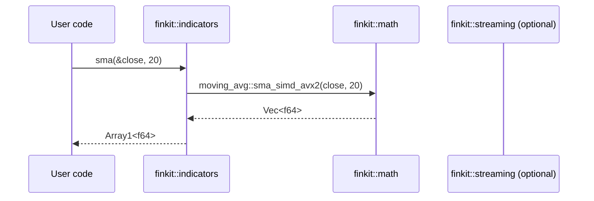
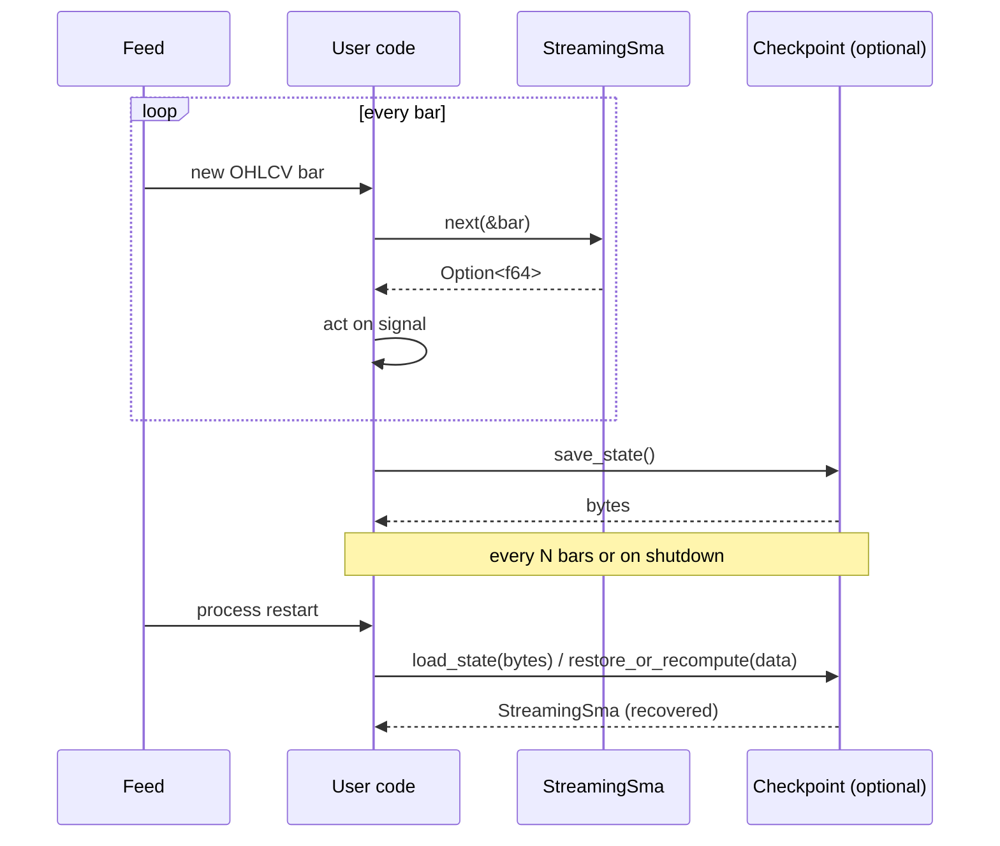
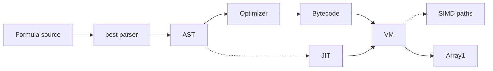
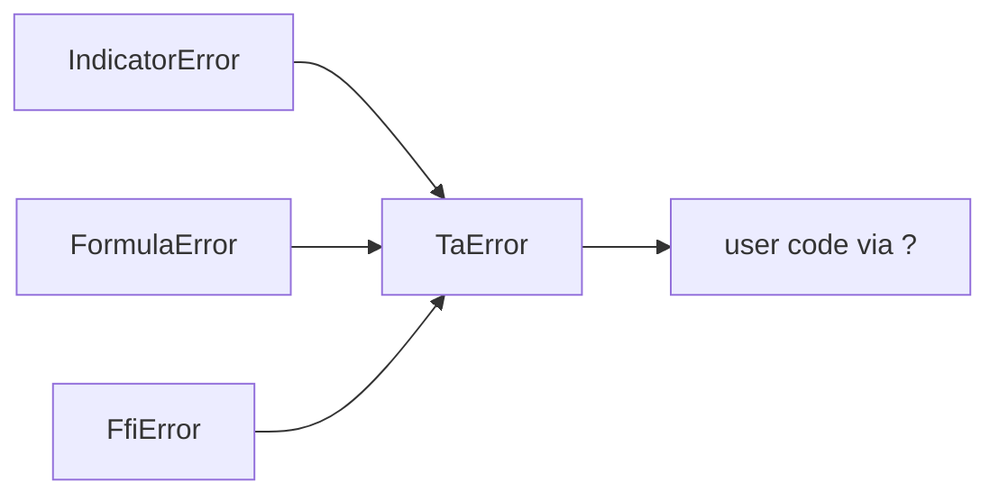

# Finkit — Data flow

End-to-end data flow for the two primary usage patterns.

## Backtest (batch)

## Live trading (streaming)

## Formula engine

## Error propagation

## Cross-references

- [Overview](overview.md)
- [Formula engine](formula-engine.md)
