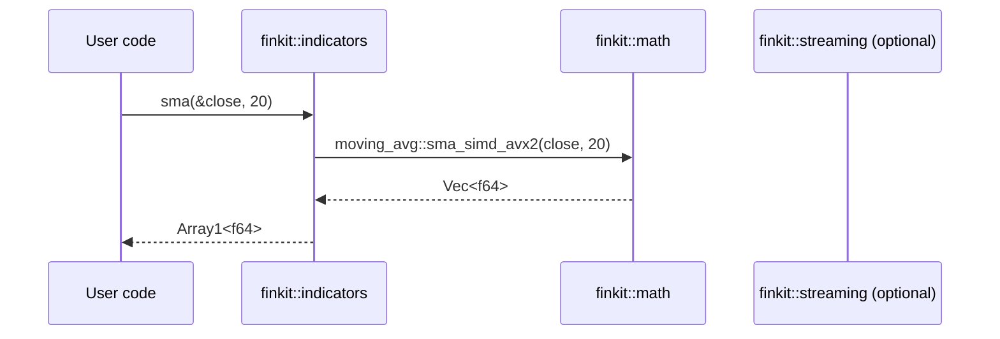
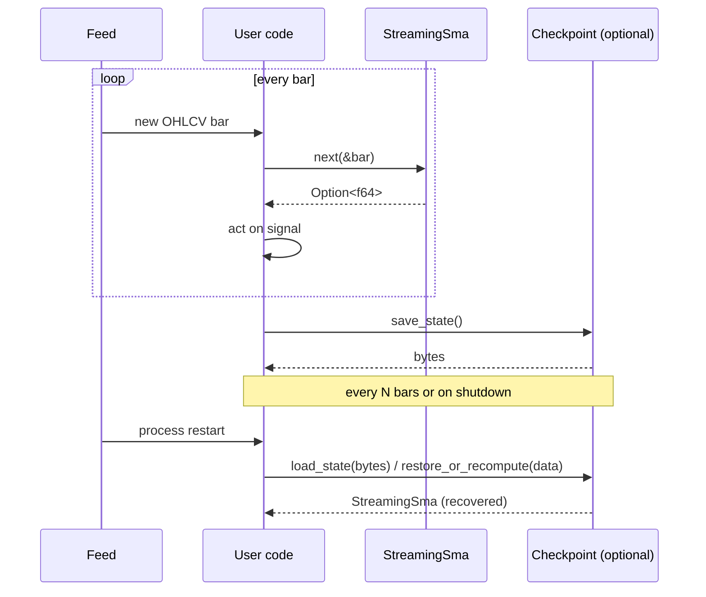
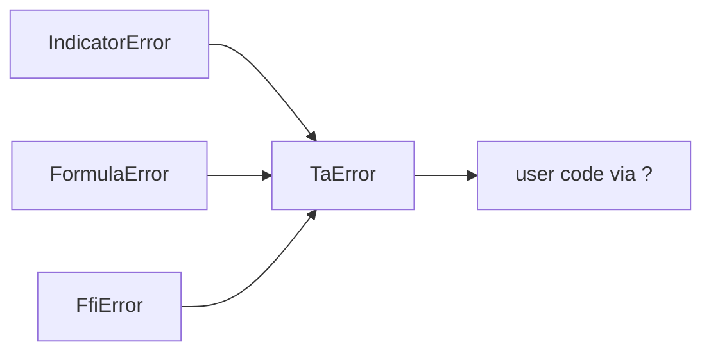

# Finkit — Data flow

End-to-end data flow for the two primary usage patterns.

## Backtest (batch)

```mermaid
sequenceDiagram
  participant U as User code
  participant C as finkit::indicators
  participant M as finkit::math
  participant S as finkit::streaming (optional)

  U->>C: sma(&close, 20)
  C->>M: moving_avg::sma_simd_avx2(close, 20)
  M-->>C: Vec<f64>
  C-->>U: Array1<f64>
```

## Live trading (streaming)

```mermaid
sequenceDiagram
  participant F as Feed
  participant U as User code
  participant S as StreamingSma
  participant CH as Checkpoint (optional)

  loop every bar
    F->>U: new OHLCV bar
    U->>S: next(&bar)
    S-->>U: Option<f64>
    U->>U: act on signal
  end

  U->>CH: save_state()
  CH-->>U: bytes
  Note over U,CH: every N bars or on shutdown

  F->>U: process restart
  U->>CH: load_state(bytes) / restore_or_recompute(data)
  CH-->>U: StreamingSma (recovered)
```

## Formula engine

The same AST feeds two peer backends. The **tree interpreter is the default**
and the reference every differential gate compares against; the **compiled plan
is opt-in** (`FormulaExecutionMode::Plan`) and is reached through
`compile_plan` / `eval_plan` or by selecting the plan backend. Bytecode and
`eval_jit` are frozen legacy modes, not part of the default pipeline.

```mermaid
flowchart LR
  src[Formula source] --> p[pest parser]
  p --> ast[AST]
  ast --> opt[Optimizer]
  opt -->|default| tree[Tree interpreter]
  opt -->|lower| graph[SemanticGraph] --> plan[ComputePlan]
  plan --> exec[UnifiedExecutor]
  tree --> out[Array1 f64]
  exec --> out
  opt -.->|frozen| bc[Bytecode VM]
  opt -.->|frozen| jit[eval_jit]
```

When selected and the formula can be lowered, the two live backends must return
the same numbers; a formula the plan cannot lower fails with
`FormulaError::BackendUnsupported` instead of silently using the tree. See
[Formula engine](formula-engine.md) for the entry-point matrix and
[runtime-and-cache-contract.md](runtime-and-cache-contract.md) for the caches
each backend reads.

## Error propagation

```mermaid
flowchart LR
  ind[IndicatorError] --> ta[TaError]
  form[FormulaError] --> ta
  ffi[FfiError] --> ta
  ta --> user[user code via ?]
```

## Cross-references

- [Overview](overview.md)
- [Formula engine](formula-engine.md)
