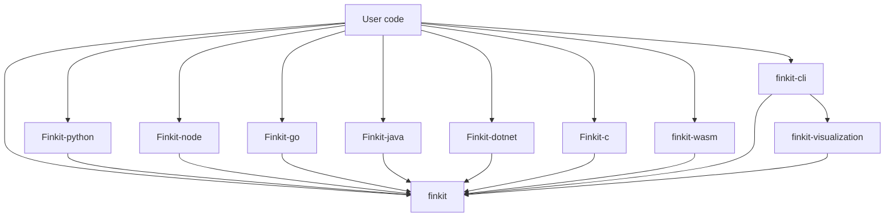

# Finkit — Architecture Overview

This document is the canonical reference for the Finkit crate structure,
dependency graph, and main entry points. Diagrams are Mermaid (rendered by
GitHub / GitLab / VS Code).

## Crate graph



## Crate roles

| Crate | Role | Output |
|-------|------|--------|
| `finkit` | Indicators, math, formula engine, traits | `rlib` (consumed by all others) |
| `finkit-cli` | Command-line interface | `bin` + reusable lib |
| `finkit-wasm` | Browser / Node.js WASM bindings | `wasm-bindgen` output |
| `Finkit-python` | PyO3 bindings | `.whl` / sdist |
| `Finkit-node` | `napi-rs` bindings | `node-addon-api` binary |
| `Finkit-go` | `cgo` bindings | C-shim + Go package |
| `Finkit-java` | JNI bindings | `.so` / `.dll` + `.jar` |
| `Finkit-dotnet` | P/Invoke bindings | NuGet package |
| `Finkit-c` | Pure-C ABI | `.a` / `.so` / `.dll` |
| `finkit-visualization` | Chart rendering (SVG/PNG/HTML) | `rlib` |

## Layering

```
┌──────────────────────────────────────────────────────┐
│ User code (Python / Node / Go / Java / .NET / Rust)  │
└──────────────────────────────────────────────────────┘
                       ▲
┌──────────────────────────────────────────────────────┐
│ FFI bindings (per-language)                          │
└──────────────────────────────────────────────────────┘
                       ▲
┌──────────────────────────────────────────────────────┐
│ Public Rust API (finkit)                        │
│  ├─ traits      (Ohlcv, StreamingIndicator, Batch…)  │
│  ├─ indicators  (overlap, momentum, volume, …)      │
│  ├─ formula     (parser, AST, bytecode, JIT, SIMD)   │
│  ├─ streaming   (O(1) per-bar updates)               │
│  ├─ features    (ML pipelines, transformations)     │
│  ├─ math        (moving_avg, simd_kernels, stats)    │
│  └─ patterns    (candlestick, chart)                 │
└──────────────────────────────────────────────────────┘
                       ▲
┌──────────────────────────────────────────────────────┐
│ Math + SIMD kernels                                  │
│  • std / no_std split                                │
│  • AVX2 / FMA / BMI2 on x86-64-v3 (perf-gate)        │
└──────────────────────────────────────────────────────┘
```

## Cross-references

- [Data flow](dataflow.md) — request lifecycle.
- [Formula engine](formula-engine.md) — internal stages of formula eval.
- [api-reference.md](../api-reference.md) — public API surface (English).
- [BENCHMARK_REPORT.md](../BENCHMARK_REPORT.md) — performance baseline.
