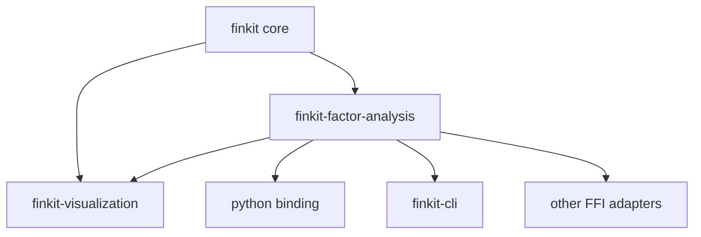
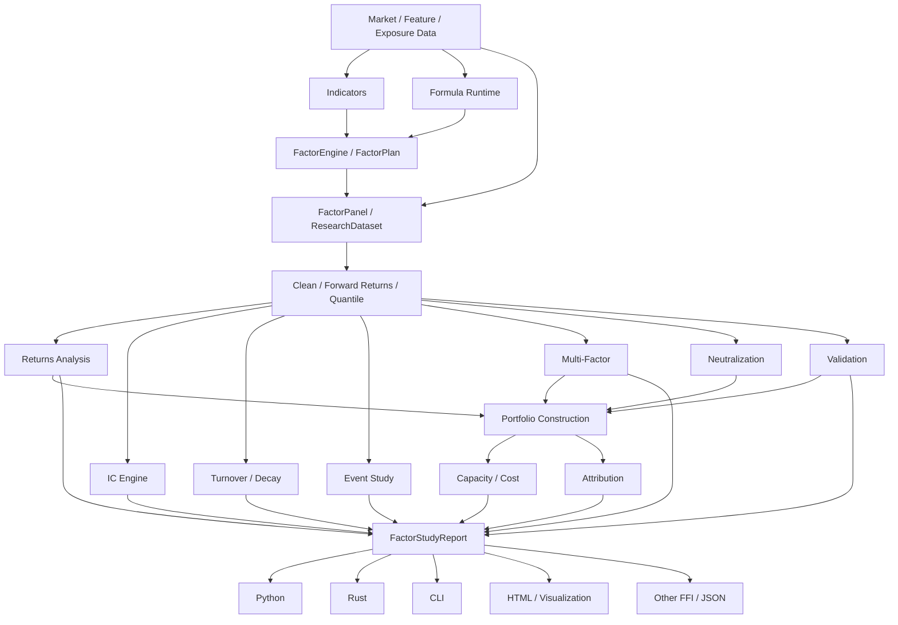

# Finkit Factor Research / Alphalens Expansion Plan V2

> 状态：Architecture / Refactor Plan  
> 目标：在不破坏现有指标、Formula、Factor Runtime、Streaming、多语言绑定的前提下，把 Finkit 从“高性能指标与因子计算库”扩展为“高性能因子研究与评价基础设施”。  
> Alphalens 兼容基线：`alphalens-reloaded==0.4.6`，兼容测试必须固定版本与 golden fixtures。  
> 本文只定义架构、模块边界、接口、门禁与实施顺序；版本号在功能与发布门禁完成前不提前变更。

---

## 1. 背景与目标

Finkit 当前已经具备较强的底层基础：

- `MarketFrame` / `SeriesView` / `NanPolicy` / `WarmupPolicy`；
- `FactorRegistry` / `FactorDefinition` / `FactorEngine` / `FactorPlan`；
- Factor DAG、依赖检测、循环检测、缓存、borrowed zero-copy 输入；
- `zscore` / `percentile_rank` / `winsorize` / 单 exposure `neutralize`；
- Formula runtime、批量计算、增量执行、BufferArena；
- Risk、轻量 vectorized backtest、Sector、Visualization；
- `features/` 下已经存在 CV split、PCA、regime、stability、selection、importance、labels、meta-labels、microstructure、feature store 等模块；
- Python / Node / Java / C / Go / .NET / Android / iOS / WASM 等多语言入口。

因此本轮不应该简单“把 Alphalens Python 函数翻译成 Rust”，而应该增加一个新的 **Factor Research Layer**，统一承接：

1. Alphalens 全部核心功能；
2. 多因子分析；
3. 稳定性与衰减分析；
4. 横截面风险暴露与中性化；
5. 组合构建、容量与交易成本分析；
6. Walk-forward / Purged CV / 统计显著性验证；
7. 因子归因与冗余分析；
8. 事件研究；
9. 报告、可视化、CLI 与多语言输出；
10. Formula / Factor DAG → Research → Portfolio 的完整链路。

最终形成：

```text
Market / Feature Data
        ↓
Indicators / Formula / FactorEngine
        ↓
FactorPanel / ResearchDataset
        ↓
Factor Analysis Engine
        ↓
Validation / Multi-Factor / Risk / Portfolio / Event
        ↓
FactorStudyReport
        ↓
Python / Rust / CLI / JSON / HTML / Web / Other FFI
```

---

## 2. 核心设计原则

### 2.1 不污染现有 Core 热路径

禁止把 Alphalens 的 pandas 语义、Tear Sheet、groupby-style 报告逻辑直接堆到 `core/src/factors.rs`。

现有 `core` 继续承担：

- 指标；
- 数学内核；
- Formula；
- Factor DAG；
- Streaming；
- 基础 transforms / risk / features。

新的研究层负责：

- 多资产横截面面板；
- forward returns；
- quantile/bin；
- IC；
- turnover；
- event；
- multi-factor；
- risk exposure；
- portfolio；
- statistics；
- reports。

### 2.2 计算层与表现层分离

禁止：

```text
calculate_ic() → matplotlib plot
```

必须：

```text
calculate_ic()
     ↓
InformationReport
     ↓
JSON / HTML / Python DataFrame / chart renderer
```

所有研究结果首先是稳定、可序列化的数据模型。

### 2.3 双模式

```rust
pub enum AnalysisMode {
    AlphalensCompat,
    Native,
}
```

`AlphalensCompat`：优先复现 Alphalens 0.4.6 的输出语义。  
`Native`：允许使用更严格、更安全、更快的 Finkit 原生语义。

### 2.4 No-lookahead 是硬门禁

任何 forward return、label、event、portfolio、validation API 都必须显式描述：

```text
factor_time
execution_lag
entry_price
holding_period
exit_price
```

不允许通过隐式 DataFrame shift 掩盖时间语义。

### 2.5 Columnar + segmented execution

内部不复制 Pandas MultiIndex，而采用列式表示 + `date_offsets` / `group_offsets`。

热路径禁止反复 String hash / groupby / pivot / stack / unstack。

---

## 3. 推荐 Workspace 架构

第一阶段推荐新增独立 crate：

```text
factor-analysis/
```

后续规模扩大后再按依赖稳定性拆成 `research-core` / `portfolio`，不要一开始过度拆包。

```text
finkit/
├── core/
│   ├── indicators/
│   ├── formula/
│   ├── factors.rs
│   ├── runtime.rs
│   ├── calendar.rs
│   ├── features/
│   ├── risk.rs
│   └── ...
│
├── factor-analysis/                 # NEW
│   └── src/
│       ├── lib.rs
│       ├── data/
│       ├── prepare/
│       ├── returns/
│       ├── information/
│       ├── turnover/
│       ├── event/
│       ├── multifactor/
│       ├── neutralization/
│       ├── stability/
│       ├── validation/
│       ├── portfolio/
│       ├── attribution/
│       ├── capacity/
│       ├── statistics/
│       ├── report/
│       └── compat/
│
├── visualization/
│   └── factor_analysis/
│
├── ffi/python-binding/
│   └── alphalens_compat/
│
└── cli/
    └── factor/
```

依赖方向固定为：



禁止 `core -> factor-analysis` 反向依赖。

---

## 4. Research Data Model：本轮最关键的基础设施

### 4.1 `AssetId` / `GroupId`

热路径使用整数 ID，名称只保留在 dictionary：

```rust
pub type AssetId = u32;
pub type GroupId = u32;
```

### 4.2 `FactorPanel`

语义等价于 Alphalens 的 `(date, asset)` MultiIndex：

```rust
pub struct FactorPanel {
    pub timestamps: Vec<i64>,
    pub assets: Vec<AssetId>,
    pub factor: Vec<f64>,
    pub groups: Option<Vec<GroupId>>,
    pub quantiles: Option<Vec<u16>>,
    pub date_offsets: Vec<usize>,
}
```

约束：

- `(timestamp, asset)` 唯一；
- 按 `(timestamp, asset)` 稳定排序；
- 同日期横截面是连续 slice；
- 保留 NaN，不允许静默 realign；
- 重复键、倒序、无效 group ID 直接报错。

### 4.3 `PricePanel`

```rust
pub struct PricePanel {
    pub timestamps: Vec<i64>,
    pub assets: Vec<AssetId>,
    pub close: Vec<f64>,
    pub open: Option<Vec<f64>>,
    pub vwap: Option<Vec<f64>>,
    pub volume: Option<Vec<f64>>,
    pub amount: Option<Vec<f64>>,
    pub date_offsets: Vec<usize>,
}
```

必须允许稀疏 universe，而不是要求每个日期所有股票完全相同。

### 4.4 `ForwardReturnMatrix`

```rust
pub struct ForwardReturnMatrix {
    pub periods: Vec<ForwardPeriod>,
    pub values: Vec<f64>,       // period-major or row-major, benchmark 后决定
    pub rows: usize,
}
```

### 4.5 `ExposurePanel`

支持 size / beta / volatility / industry / custom style exposures：

```rust
pub struct ExposurePanel {
    pub timestamps: Vec<i64>,
    pub assets: Vec<AssetId>,
    pub continuous: ExposureMatrix,
    pub categorical: CategoricalExposureMatrix,
}
```

### 4.6 `ResearchDataset`

统一研究入口：

```rust
pub struct ResearchDataset {
    pub factor: FactorPanel,
    pub prices: PricePanel,
    pub benchmark: Option<BenchmarkSeries>,
    pub exposures: Option<ExposurePanel>,
    pub universe: Option<UniverseMask>,
    pub calendar: TradingCalendar,
}
```

---

## 5. Module A：Forward Return Engine

完整覆盖 Alphalens `compute_forward_returns`，并增加严格时间语义。

### 功能

- Bars horizon：1 / 5 / 10 / 20 bars；
- Duration horizon：30m / 3h / 1D / 5D；
- custom trading calendar；
- cumulative / non-cumulative；
- entry / exit price convention；
- execution lag；
- excess return vs benchmark；
- group-relative return；
- residual forward return（风险模型残差）；
- outlier diagnostics；
- sparse price handling。

### API

```rust
pub enum PriceConvention {
    SameBarClose,
    NextBarOpen,
    NextAvailable,
    Vwap,
    Explicit,
}

pub struct ForwardReturnConfig {
    pub periods: Vec<ForwardPeriod>,
    pub cumulative: bool,
    pub execution_lag: ExecutionLag,
    pub entry_price: PriceConvention,
    pub exit_price: PriceConvention,
    pub benchmark_mode: BenchmarkMode,
}
```

### 门禁

- Alphalens compat fixtures；
- weekend / holiday / intraday；
- delisted / halted / sparse asset；
- 不允许未来价格进入 factor timestamp 之前的数据切片。

---

## 6. Module B：Clean / Alignment / Data Quality Engine

统一替代零散 `dropna + align + qcut` 流程。

```text
Factor
  → key validation
  → price alignment
  → calendar alignment
  → universe mask
  → group/exposure join
  → forward returns
  → quantization
  → finite-value policy
  → loss accounting
  → CleanFactorData
```

### `DataLossReport`

```rust
pub struct DataLossReport {
    pub initial_rows: usize,
    pub final_rows: usize,
    pub missing_price: usize,
    pub missing_forward_return: usize,
    pub quantization_failure: usize,
    pub missing_group: usize,
    pub missing_exposure: usize,
    pub universe_filtered: usize,
    pub nonfinite_factor: usize,
    pub total_loss_ratio: f64,
}
```

除了 `max_loss`，增加：

- per-date coverage；
- per-asset coverage；
- universe survivorship warning；
- stale price warning；
- duplicate-key diagnostics；
- factor timestamp leakage diagnostics。

---

## 7. Module C：Quantile / Bin / Cross-sectional Transform Engine

完整支持：

- quantiles=N；
- custom quantile edges；
- fixed bins；
- custom bin edges；
- by group；
- zero-aware；
- percentile rank；
- winsorize；
- z-score；
- robust z-score（median/MAD）；
- clip；
- rank gaussian / normal score；
- deterministic ties；
- minimum group size。

```rust
pub enum BucketMethod {
    Quantiles(usize),
    QuantileEdges(Vec<f64>),
    Bins(usize),
    BinEdges(Vec<f64>),
}
```

兼容模式严格复现 reference；Native 模式优先 deterministic + stable ties。

---

## 8. Module D：Returns Analysis

完整覆盖 Alphalens：

- `factor_weights`；
- `factor_returns`；
- `mean_return_by_quantile`；
- standard error；
- top-bottom spread；
- alpha / beta；
- cumulative returns；
- by asset；
- demeaned；
- group adjusted；
- equal weight；
- factor weighted。

同时扩展：

- benchmark excess return；
- volatility scaled return；
- long-only / short-only；
- gross/net exposure；
- hit ratio；
- downside capture；
- return concentration；
- rolling alpha / beta。

---

## 9. Module E：Information Coefficient Engine

基础：

- Spearman IC；
- Pearson IC；
- rank IC；
- by group；
- group adjusted；
- by time；
- rolling IC。

扩展：

- IC mean / std；
- ICIR；
- t-stat / p-value；
- skew / kurtosis；
- positive IC ratio；
- bootstrap confidence interval；
- Newey-West / HAC adjusted significance；
- IC decay curve；
- horizon half-life；
- conditional IC；
- regime IC；
- cross-market IC。

### 性能原则

同一个 date 的 `rank(factor)` 只计算一次，对所有 forward periods 复用。

---

## 10. Module F：Turnover / Persistence / Decay

完整覆盖：

- quantile turnover；
- factor rank autocorrelation。

进一步增加：

- rank persistence matrix；
- quantile transition matrix；
- top/bottom retention；
- factor value autocorrelation；
- decay half-life；
- rolling turnover；
- stable-universe turnover；
- entry / exit churn；
- signal age distribution。

输出统一进入 `StabilityReport`。

---

## 11. Module G：Event Study

完整覆盖：

- common-start returns；
- average cumulative return by quantile；
- pre/post event window；
- demeaned event returns；
- by group。

扩展：

- positive / negative event；
- event strength bucket；
- abnormal return / benchmark-adjusted return；
- CAR / CAAR；
- event overlap policy；
- event clustering；
- repeated event suppression window；
- event significance bootstrap。

支持：

```rust
EventWindow { before, after }
EventAlignment { Exact, NextSession, PreviousSession }
```

---

## 12. Module H：Multi-Factor Analysis

这是超过 Alphalens 的核心模块之一。

### 功能

- factor correlation matrix；
- rank correlation matrix；
- IC correlation matrix；
- horizon × factor IC matrix；
- redundancy score；
- VIF；
- PCA / orthogonal components；
- Gram-Schmidt / regression residual orthogonalization；
- hierarchical clustering；
- factor family grouping；
- marginal IC；
- incremental explanatory power；
- ensemble score；
- dynamic factor weight。

### 复用现有模块

优先复用 `features/pca.rs`、`features/selection.rs`、`features/importance.rs`、`features/stability.rs`，不要重复维护第二套 PCA / feature importance。

### API

```rust
MultiFactorStudy::correlation()
MultiFactorStudy::ic_matrix()
MultiFactorStudy::redundancy()
MultiFactorStudy::orthogonalize()
MultiFactorStudy::cluster()
MultiFactorStudy::combine()
```

---

## 13. Module I：Neutralization / Cross-sectional Regression

当前单 exposure OLS 只适合最基础场景，需要升级成正式横截面 regression engine。

### 支持

- intercept；
- multiple continuous exposures；
- industry/category dummy；
- weighted least squares；
- optional robust regression；
- missing exposure policy；
- ridge fallback for singular matrix；
- standardized exposure；
- residual factor；
- residual return。

典型模型：

```text
factor = intercept
       + log_market_cap
       + beta
       + volatility
       + industry dummies
       + residual
```

必须输出：

- residual；
- coefficients；
- R²；
- condition number；
- valid sample count；
- singular/fallback diagnostics。

---

## 14. Module J：Factor Stability / Regime Analysis

复用已有 `features/regime.rs` 与 `features/stability.rs`。

新增研究级接口：

- rolling IC；
- rolling spread；
- rolling turnover；
- rolling coverage；
- structural break；
- bull/bear/sideways regime；
- high/low volatility regime；
- liquidity regime；
- market-cap regime；
- factor drift；
- degradation alert；
- regime consistency score。

目标不是“预测 regime”，而是回答：

> 这个因子在哪些市场环境有效，什么时候开始失效？

---

## 15. Module K：Research Validation / Anti-Overfitting

与现有 `features/cv_split.rs` 打通。

### 必须支持

- train / validation / test by time；
- rolling / expanding walk-forward；
- purged K-fold；
- embargo；
- overlapping label leakage protection；
- bootstrap；
- block bootstrap；
- multiple-testing correction；
- FDR；
- White Reality Check / SPA 预留接口；
- out-of-sample IC；
- out-of-sample spread；
- stability score；
- parameter sensitivity。

### 统计扩展

建议新增：

- Probabilistic Sharpe Ratio；
- Deflated Sharpe Ratio；
- minimum track record length；
- effective number of independent trials。

这些功能必须作为“研究验证”，不能混入普通 backtest 指标函数。

---

## 16. Module L：Portfolio Construction Engine

不要直接复用当前轻量 `backtest.rs` 来模拟 Alphalens 的 overlapping holdings。

新增独立 portfolio 模型：

```rust
pub struct FactorPortfolioConfig {
    pub weighting: WeightingMethod,
    pub long_short: bool,
    pub gross_leverage: f64,
    pub net_exposure: Option<f64>,
    pub holding_period: ForwardPeriod,
    pub rebalance: RebalanceRule,
    pub group_neutral: bool,
}
```

### 支持

- rank weight；
- factor value weight；
- equal weight；
- top/bottom quantile；
- long only；
- long-short；
- group neutral；
- volatility scaling；
- max single-name weight；
- sector caps；
- turnover cap；
- overlapping holding cohorts；
- cash；
- benchmark-relative portfolio。

### 第二阶段可扩展优化器

- mean-variance；
- minimum variance；
- risk parity；
- max diversification；
- tracking-error constrained；
- factor exposure constrained；
- transaction-cost aware optimization。

优化器属于可选层，不应成为 Alphalens parity 的前置依赖。

---

## 17. Module M：Capacity / Liquidity / Cost Analysis

因子“有效”不代表能交易。

新增：

- ADV / amount participation；
- position size vs liquidity；
- turnover cost；
- linear slippage model；
- square-root market impact model；
- capacity curve；
- break-even cost；
- return after cost；
- IC after liquidity filter；
- spread after liquidity filter；
- top names crowding/concentration。

接口必须允许用户注入自己的 cost model：

```rust
pub trait TransactionCostModel {
    fn estimate(&self, trade: &TradeIntent, market: &LiquiditySnapshot) -> f64;
}
```

---

## 18. Module N：Factor Attribution / Risk Attribution

新增两类 attribution，避免混为一谈。

### Factor performance attribution

回答：

> 组合收益来自哪些因子？

支持：

- factor contribution；
- marginal contribution；
- interaction contribution；
- group contribution；
- period contribution。

### Portfolio risk attribution

回答：

> 风险来自哪些 exposure？

支持：

- factor exposure；
- specific risk；
- factor covariance 接口；
- contribution to variance；
- contribution to tracking error。

第一阶段只实现可验证的线性 attribution，不提前构建完整商用 Barra clone。

---

## 19. Module O：Factor Mining / Formula Research Integration

这是 Finkit 相比 Alphalens 的独特优势。

现有 Formula / FactorEngine 可以直接生成候选因子：

```text
Formula DAG
   ↓
Candidate Factors
   ↓
FactorPanel
   ↓
Batch FactorStudy
   ↓
IC / Spread / Turnover / Stability / Cost
   ↓
Selection
```

### 第一阶段

- batch evaluate many formulas；
- shared sub-expression reuse；
- candidate metadata；
- deterministic fingerprint；
- duplicate-expression detection；
- result cache；
- screening thresholds。

### 第二阶段

- formula mutation / combination；
- symbolic search；
- genetic-programming adapter；
- Bayesian parameter search adapter。

必须设置研究防护：

- 不允许只按 in-sample IC 排名；
- 强制 OOS / walk-forward 指标；
- 记录 trial count；
- multiple-testing correction；
- complexity penalty。

---

## 20. Module P：Factor Metadata / Provenance / Registry V2

每个研究结果都必须知道因子从哪里来。

```rust
pub struct FactorMetadata {
    pub id: FactorId,
    pub name: String,
    pub version: String,
    pub formula_fingerprint: Option<String>,
    pub dependencies: Vec<FactorId>,
    pub parameters: ParameterMap,
    pub direction: FactorDirection,
    pub family: Option<String>,
    pub created_at: i64,
}
```

增加：

- factor lineage；
- source fingerprint；
- dataset fingerprint；
- calendar fingerprint；
- analysis config fingerprint；
- benchmark fingerprint。

最终一个 Report 必须可复现：

```text
factor + data + universe + calendar + config + engine version
```

---

## 21. Module Q：Research Cache / Incremental Study

百万/千万级 panel 不应每次从头计算。

缓存分层：

```text
L1  factor computation
L2  factor ranks / quantiles
L3  forward returns
L4  IC / returns / turnover aggregates
L5  report artifacts
```

Key 必须包含 provenance，不允许只用 factor name。

后续增加增量模式：

```rust
study.append_session(...)
study.update_latest(...)
study.recompute_from(timestamp)
```

原则：

- 历史 immutable segment 可复用；
- universe/group/exposure 发生变化时只失效受影响区间；
- calendar/config 变化必须使相关缓存失效。

---

## 22. Module R：Statistics Core

不要让 IC、event、portfolio 各自实现一套统计函数。

集中实现：

- mean / variance / std / standard error；
- covariance / correlation；
- Pearson / Spearman；
- quantile；
- skew / kurtosis；
- OLS / WLS；
- t-stat / p-value；
- bootstrap；
- HAC/Newey-West；
- multiple-testing correction；
- robust statistics。

数值内核应尽量落到共享 math/statistics 层，Research 层只负责 panel/group semantics。

---

## 23. Report Model

所有分析最终输出稳定结构，而不是散落的 Vec/DataFrame。

```rust
pub struct FullFactorReport {
    pub metadata: StudyMetadata,
    pub data_quality: DataQualityReport,
    pub summary: FactorSummaryReport,
    pub returns: ReturnsReport,
    pub information: InformationReport,
    pub turnover: TurnoverReport,
    pub stability: StabilityReport,
    pub groups: Option<GroupReport>,
    pub neutralization: Option<NeutralizationReport>,
    pub portfolio: Option<PortfolioReport>,
    pub capacity: Option<CapacityReport>,
    pub events: Option<EventReport>,
    pub validation: Option<ValidationReport>,
}
```

所有 report：

- `Serialize/Deserialize`；
- schema version；
- deterministic ordering；
- NaN/Inf JSON policy 明确；
- 可生成 compact / full 两种 payload。

---

## 24. Visualization / Tear Sheet V2

覆盖 Alphalens 图表，并增加研究扩展。

### Summary

- coverage；
- mean IC / ICIR；
- top-bottom spread；
- turnover；
- annualized alpha/beta；
- data loss；
- capacity snapshot。

### Returns

- quantile mean returns；
- by-date returns；
- violin；
- top-bottom spread；
- cumulative factor returns；
- rolling alpha/beta。

### IC

- IC time series；
- rolling IC；
- histogram；
- QQ；
- monthly heatmap；
- IC decay；
- IC by group / regime。

### Turnover

- quantile turnover；
- rank autocorrelation；
- transition matrix；
- holding-age / churn。

### Multi-factor

- correlation heatmap；
- IC matrix；
- redundancy clustering；
- PCA loadings。

### Validation

- train/OOS split；
- walk-forward IC；
- stability；
- parameter sensitivity；
- trial-adjusted significance。

### Event

- event distribution；
- pre/post CAR；
- CAAR；
- by group / quantile。

输出目标：

```text
HTML
SVG/PNG where supported
JSON
Python plotting adapters
Web-compatible chart data
```

---

## 25. Python Compatibility Layer

提供：

```python
import finkit.alphalens as al
```

第一阶段保持主要命名：

```text
utils
performance
plotting
tears
```

重点兼容：

- `get_clean_factor_and_forward_returns`；
- `get_clean_factor`；
- forward return columns；
- quantile/bin behavior；
- IC；
- mean IC；
- factor weights；
- factor returns；
- alpha/beta；
- cumulative returns；
- positions；
- mean return by quantile；
- mean return spread；
- quantile turnover；
- rank autocorrelation；
- event functions；
- tear-sheet entrypoints。

内部路径：

```text
Pandas Series/DataFrame
       ↓ adapter only
contiguous NumPy / encoded IDs
       ↓ PyO3
Rust Factor Analysis
       ↓
NumPy / Arrow buffers
       ↓ adapter only
Pandas-compatible output
```

禁止 Rust Core 依赖 pandas。

---

## 26. Rust Native API

推荐高层 API：

```rust
let dataset = ResearchDataset::builder()
    .factor(factor_panel)
    .prices(price_panel)
    .calendar(calendar)
    .groups(groups)
    .exposures(exposures)
    .build()?;

let study = FactorStudy::builder(dataset)
    .periods([1, 5, 10, 20])
    .quantiles(5)
    .mode(AnalysisMode::Native)
    .build()?;

let report = study.full_report()?;
```

按需执行：

```rust
study.returns()?;
study.information()?;
study.turnover()?;
study.stability()?;
study.events()?;
study.portfolio()?;
study.capacity()?;
study.validation()?;
```

Multi-factor：

```rust
let multi = MultiFactorStudy::new(dataset, factors)?;
let ic = multi.ic_matrix()?;
let redundancy = multi.redundancy()?;
```

---

## 27. CLI

增加：

```text
finkit factor clean
finkit factor ic
finkit factor returns
finkit factor turnover
finkit factor event
finkit factor full-report
finkit factor compare
finkit factor validate
```

输入第一阶段支持：

- CSV；
- JSON；
- Arrow/Parquet 可选特性。

输出：

- table；
- JSON；
- HTML report。

CLI 不应自己实现分析算法，只调用 `factor-analysis` crate。

---

## 28. 多语言策略

不要一开始强求所有语言 100% 暴露全部 API。

### Tier 1

Rust + Python：完整研究能力。

### Tier 2

Node / Java / .NET / Go：

- FactorPanel 输入；
- IC；
- quantile returns；
- turnover；
- summary/full report JSON。

### Tier 3

C ABI / mobile / WASM：

- 结构化 JSON report；
- compact numerical API；
- 不强制暴露复杂 regression builder。

这样避免复杂 FFI 结构拖慢核心研发。

---

## 29. 性能架构

### 29.1 Segmented execution

`date_offsets`：

```text
[0, 3988, 8012, 12017, ...]
```

所有横截面计算直接处理：

```rust
&values[offsets[d]..offsets[d + 1]]
```

### 29.2 中间结果共享

一个日期内：

- factor rank 只算一次；
- quantile 只算一次；
- group index 只编码一次；
- benchmark return 只算一次；
- 每个 forward horizon 复用同一 factor rank。

### 29.3 Buffer 生命周期

研究层增加独立 `ResearchArena`，但底层 scratch 策略应复用 BufferArena 思路：

```text
Factor buffers
Rank buffers
Group reductions
Regression scratch
Return scratch
```

### 29.4 Parallelism

默认优先：

- date segment parallel；
- factor parallel；
- period parallel。

避免同一个小 segment 内过度并行。

### 29.5 可选 Arrow/Polars

作为 feature，不进入最小 core dependency：

```text
factor-analysis = core only
factor-analysis-arrow = optional adapter
python pandas = adapter
```

---

## 30. Benchmark 设计

External benchmark：

```text
finkit-factor-analysis
vs
alphalens-reloaded==0.4.6
```

测试集：

| Dataset | Sessions | Assets | Approx Rows |
| --- | ---: | ---: | ---: |
| Small | 250 | 500 | 125K |
| Medium | 1,250 | 2,000 | 2.5M |
| Large | 2,500 | 5,000 | 12.5M |

测量：

- wall time；
- peak RSS；
- allocation count；
- rows/sec；
- quantization throughput；
- forward-return throughput；
- IC throughput；
- full-study throughput。

External benchmark 只做事实比较，不写死“必须快 N 倍”。

CI hard gate 使用自身 baseline：

- hot path 不允许无解释 >15% regression；
- memory 不允许明显失控；
- million-row benchmark 必须避免 O(N²)。

---

## 31. Alphalens Parity Test Matrix

目录：

```text
tests/alphalens_parity/
```

Reference environment 固定：

```text
alphalens-reloaded==0.4.6
pandas=<pinned>
numpy=<pinned>
scipy=<pinned>
statsmodels=<pinned>
```

覆盖：

- normal factor；
- ties；
- constant factor；
- positive-only；
- negative-only；
- zero-aware；
- NaN/Inf；
- sparse universe；
- missing price；
- missing group；
- custom quantile；
- custom bins；
- by group；
- intraday；
- timezone aware/naive；
- custom holidays；
- cumulative true/false；
- overlapping holdings；
- max_loss；
- event study。

门禁：

```text
index/key parity        exact
quantile IDs            exact
NaN location            exact
weights                 tight tolerance
returns                 tight tolerance
IC                      tight tolerance
turnover                tight tolerance
alpha/beta              documented tolerance
```

最终目标：

```text
Alphalens compatibility test failures = 0
```

---

## 32. Research Safety / Correctness Gates

除了 parity，必须单独验证 Finkit Native 模式：

### No-lookahead

- forward price 不早于 execution time；
- rolling factor 不访问 future slice；
- event window 明确 pre/post；
- cross-validation purge/embargo 正确。

### Alignment

- `(timestamp, asset)` 唯一；
- same timestamp cross-section 一致；
- universe mask 不发生未来回填；
- group/exposure point-in-time join。

### Statistical correctness

- Spearman ties；
- constant vector；
- singular regression；
- small sample；
- zero variance；
- NaN policy；
- bootstrap reproducibility。

### Lifecycle

- cache provenance；
- stale plan；
- incremental update；
- config fingerprint invalidation。

---

## 33. 与现有 Finkit 模块的整合规则

### `core/src/factors.rs`

保留：factor definition / DAG / evaluation / basic transforms。  
不要放：IC / turnover / event / reports。

### `core/src/features/*`

继续承担 feature engineering 算法。Research 层通过 adapter 使用 PCA、selection、stability、regime、CV、labels 等功能。

### `core/src/backtest.rs`

继续作为轻量 signal validation backtester。  
Alphalens overlapping holdings 与 factor portfolio 单独放入 research portfolio engine。

### `core/src/sector.rs`

继续承担 sector index / rotation。  
Research `group` 是通用 asset classification，不与 sector 模块硬绑定。

### `core/src/risk.rs`

保留通用 portfolio risk metrics。  
Research 层复用这些函数，但 factor attribution / exposure regression 单独实现。

### `visualization/`

只负责 rendering，不拥有研究算法。

---

## 34. 建议实施阶段

### Phase 0：Specification / Golden Reference

- 固定 Alphalens 0.4.6 reference env；
- 建 golden dataset；
- 建 public API inventory；
- 建 parity runner；
- 增加 architecture doc gate。

**出口：Reference 可重复运行。**

### Phase 1：Research Data Core

- `factor-analysis` crate；
- Asset/Group dictionary；
- FactorPanel；
- PricePanel；
- ResearchDataset；
- validation；
- date offsets。

**出口：数据模型、稀疏 universe、排序/唯一性测试全部绿色。**

### Phase 2：Preparation / Alphalens Utils

- forward returns；
- clean factor；
- group join；
- quantile/bin；
- zero-aware；
- max_loss/data quality。

**出口：utils parity failure=0。**

### Phase 3：Returns

- weights；
- factor returns；
- quantile returns；
- spread；
- alpha/beta；
- cumulative；
- positions/overlap cohorts。

**出口：performance parity failure=0。**

### Phase 4：IC / Turnover / Event

- IC；
- mean IC；
- group/time aggregation；
- quantile turnover；
- rank autocorrelation；
- event study。

**出口：核心 Alphalens numerical parity=0。**

### Phase 5：Report / Visualization / Python Compat

- report schema；
- tear sheets；
- HTML；
- Python `finkit.alphalens`；
- Pandas adapters。

**出口：核心 Alphalens user workflow 可迁移。**

### Phase 6：Multi-factor / Neutralization

- correlation；
- IC matrix；
- redundancy；
- PCA adapter；
- multi-exposure neutralization；
- orthogonalization。

**出口：多因子研究完整链路。**

### Phase 7：Stability / Validation

- IC decay；
- regime；
- rolling stability；
- walk-forward；
- purged CV；
- embargo；
- FDR/DSR 等统计验证。

**出口：研究防过拟合链路。**

### Phase 8：Portfolio / Capacity / Attribution

- portfolio construction；
- constraints；
- costs；
- capacity；
- factor attribution；
- risk attribution。

**出口：从研究统计到可交易性评估完整。**

### Phase 9：Formula Mining / Incremental Research

- multi-formula batch；
- provenance；
- cache；
- incremental sessions；
- candidate screening；
- optional symbolic search adapters。

**出口：Finkit 原生 Alpha Research pipeline。**

### Phase 10：Multi-language Expansion

- Node/Java/.NET/Go summary APIs；
- C compact ABI；
- WASM report JSON；
- package smoke tests。

---

## 35. 推荐 PR 拆分

不要用一个超大 PR 一次提交全部逻辑。

```text
PR-A  spec + golden reference
PR-B  factor-analysis crate + data model
PR-C  forward returns + alignment
PR-D  quantile/bin + clean + data quality
PR-E  weights + factor returns
PR-F  quantile returns + spread + alpha/beta
PR-G  overlapping portfolio positions
PR-H  IC + aggregation
PR-I  turnover + persistence
PR-J  event study
PR-K  report schema
PR-L  visualization + HTML
PR-M  Python Alphalens compatibility
PR-N  multi-factor analysis
PR-O  multi-exposure neutralization
PR-P  stability + regime
PR-Q  research validation
PR-R  portfolio + costs + capacity
PR-S  attribution
PR-T  formula research + caching/incremental
PR-U  other language bindings
```

每个 PR 必须有自己的行为门禁，不能“先把实现放进去，测试以后补”。

---

## 36. 发布条件（Definition of Done）

### Alphalens Core

```text
Forward Returns              PASS
Clean Factor                 PASS
Quantile / Bin               PASS
Zero-aware                   PASS
Group Binning                PASS
Max Loss / Data Quality      PASS
Factor Weights               PASS
Factor Returns               PASS
Mean Quantile Returns        PASS
Top-Bottom Spread            PASS
Alpha/Beta                   PASS
Cumulative Returns           PASS
Overlapping Positions        PASS
Spearman IC                  PASS
Mean IC                      PASS
IC By Group / Time           PASS
Quantile Turnover            PASS
Rank Autocorrelation         PASS
Event Study                  PASS
```

### Finkit Extended Research

```text
Multi-factor correlation     PASS
IC matrix                    PASS
Redundancy / clustering      PASS
Multi-exposure neutralize    PASS
Stability / decay            PASS
Regime analysis              PASS
Walk-forward validation      PASS
Purged CV / embargo          PASS
Portfolio construction       PASS
Cost / capacity              PASS
Attribution                  PASS
Provenance                   PASS
```

### Platform

```text
Rust native API              PASS
Python native API            PASS
Python Alphalens compat      PASS
Report JSON schema           PASS
HTML report                  PASS
CLI                          PASS
Docs                         PASS
```

### Quality

```text
Alphalens parity failures = 0
No-lookahead failures = 0
Cross-sectional alignment failures = 0
Cache provenance failures = 0
Known O(N²) hot paths = 0
Core CI regression = 0
Docs/link/version gates = green
```

---

## 37. 不应在本轮做的事情

为了避免范围失控，明确以下边界：

- 不把 Finkit 改造成 broker/trading execution engine；
- 不在第一阶段复制完整 Pyfolio；
- 不在第一阶段复制完整 Barra 商业风险模型；
- 不为了 pandas compatibility 让 Rust core 依赖 Python/Pandas；
- 不在 parity 尚未完成时先宣传固定“快 N 倍”；
- 不为了兼容历史 API 牺牲 Native 模式的 no-lookahead contract；
- 不强迫每种 FFI 在第一版暴露所有复杂 builder；
- 不把 research cache 与普通 Formula runtime cache 混成无 provenance 的全局缓存。

---

## 38. 最终目标架构



最终 Finkit 的定位可以从：

> High-performance technical analysis library

进一步扩展为：

> High-performance technical analysis, factor computation and alpha research infrastructure.

但 README / package description 的公开定位变化必须等核心研究链路、测试和发布资产真实完成后再修改，不能提前声明未交付能力。
