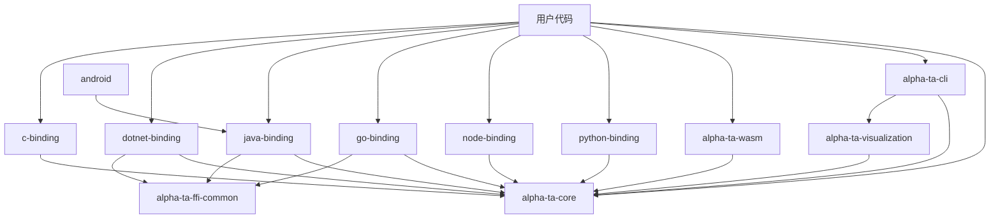

# 01 · 整体架构

本文是 finkit（AlphaTA）仓库结构与各 crate 职责的权威参考，包含 Cargo workspace 组成、分层模型与依赖关系图。

## 1. 仓库定位

一个 Rust 编写的 **金融/证券技术分析引擎**，其上叠加了一层 **多语言 FFI 绑定**。
核心关注点：

1. **正确性**：与通达信(TDX)/同花顺(THS)/大智慧(DZH) 兼容（公式系统），与 TA-Lib 输出对齐（黄金向量回归测试）。
2. **高性能**：SIMD（AVX2/FMA/BMI2）+ 零分配热路径 + 流式 O(1) 增量更新。
3. **多语言**：同一份 Rust 核心，暴露给 Python/Node/Go/Java/.NET/C/C++/WASM。

## 2. 顶层目录

```text
finkit/
├── core/                  # alpha-ta-core：核心引擎库（最大，几乎所有逻辑在此）
├── visualization/         # alpha-ta-visualization：K线图渲染（SVG/PNG/HTML）
├── cli/                   # alpha-ta-cli：命令行工具（14 个子命令）
├── wasm/                  # alpha-ta-wasm：WASM 绑定
├── ffi/                   # 各语言 FFI 绑定 + 共享辅助 crate
│   ├── c-binding/         #   C/C++ 绑定（基础 ABI 层）
│   ├── python-binding/    #   Python（PyO3 / maturin）
│   ├── node-binding/      #   Node.js（napi-rs）
│   ├── go-binding/        #   Go（cgo）
│   ├── java-binding/      #   Java（JNI）
│   ├── dotnet-binding/    #   .NET（P/Invoke）
│   ├── ios-binding/       #   iOS（xcframework）
│   ├── android-binding/   #   Android（JNI）
│   └── ffi-common/        #   alpha-ta-ffi-common：绑定共享的 error/panic/leak/registry 工具
├── examples/              # 各语言用法示例 + Jupyter notebooks
├── fuzz/                  # fuzz 测试 targets（formula、indicators、streaming）
├── core/benches/          # Criterion 基准（性能门禁）
├── tests/                 # 顶层 Golden / 兼容性用例（TDX/THS/DZH）
└── docs/                  # 文档与 mdBook；本套 Code Wiki 位于 docs/code-wiki/
```

## 3. Cargo Workspace

`Cargo.toml`（根）定义工作区与统一发布配置：

- **members**：`core`、`visualization`、`cli`、`wasm`、`ffi/{c-binding,ffi-common,python-binding,node-binding,go-binding,dotnet-binding,ios-binding,java-binding,android-binding}`
- **共享元数据**（`[workspace.package]`）：`version=1.0.0`、`edition=2021`、`rust-version=1.75`（MSRV）、`license="MIT OR Apache-2.0"`、`repository=coeasy/finkit`
- **工作区统一依赖**（`[workspace.dependencies]`）：`serde`、`serde_json`、`ndarray`、`thiserror`、`jni`、`tracing`、`tracing-subscriber`、`metrics`、`metrics-exporter-prometheus`
- **发布 profile 调优**：`[profile.release]` 使用 `lto="thin"`、`codegen-units=1`、`strip="debuginfo"`；FFI 绑定 crate 单独设为 `codegen-units=16` 以加快编译；`[profile.bench]` 使用 `lto="fat"` + `target-cpu=native` 追求极限吞吐。

## 4. 分层模型

```text
┌──────────────────────────────────────────────────────────────┐
│  用户代码：Python / Node / Go / Java / .NET / C / Rust        │
└───────────────────────────────▲──────────────────────────────┘
                                 │
┌───────────────────────────────┴──────────────────────────────┐
│  FFI 绑定层（每个语言一个绑定 crate，薄封套）                   │
└───────────────────────────────▲──────────────────────────────┘
                                 │
┌───────────────────────────────┴──────────────────────────────┐
│  alpha-ta-core 公共 Rust API                                  │
│   ├─ traits      Ohlcv / StreamingIndicator / BatchIndicator │
│   ├─ indicators  批量指标（overlap/momentum/volume/...）      │
│   ├─ streaming   流式 O(1) 指标（98 个）                      │
│   ├─ formula     公式引擎（parser→AST→bytecode→JIT→SIMD）     │
│   ├─ features    ML 特征工程                                  │
│   ├─ math        数学基元 + SIMD 内核                          │
│   └─ patterns    K线/图表形态识别                              │
└───────────────────────────────▲──────────────────────────────┘
                                 │
┌───────────────────────────────┴──────────────────────────────┐
│  math + SIMD 内核（std/no_std 分离，AVX2/FMA/BMI2，NEON）      │
└──────────────────────────────────────────────────────────────┘
```

## 5. Crate 依赖图



依赖方向要点：

- **`alpha-ta-core` 是被所有 crate 依赖的"中心"。** 任何绑定、CLI、WASM、可视化都只调用 core 的公共 API。
- `alpha-ta-visualization` 单独依赖 core，提供 K 线渲染能力；CLI 与 Python 绑定复用（Python 通过 `PyKlineChart` 暴露可视化）。
- `alpha-ta-ffi-common` 供各绑定共享 `error.rs`（错误→字符串）、`golden.rs`（黄金向量）、`leak.rs`（内存泄漏巡检）、`panic.rs`（跨 FFI panic 保护）、`registry.rs`（注册表）、`types.rs`（C 桩类型）。

## 6. 各 crate 角色

| Crate | 角色 | 产物 |
|-------|------|------|
| `alpha-ta-core` | 指标/数学/公式/流式/特征/形态 | `rlib`（被所有其他 crate 消费） |
| `alpha-ta-visualization` | K 线图表渲染（SVG/PNG/HTML，纯 Rust） | `rlib` |
| `alpha-ta-cli` | 命令行接口（14 个子命令） | `bin` |
| `alpha-ta-wasm` | 浏览器/Node WASM 绑定 | `wasm-bindgen` 产物 |
| `python-binding` | PyO3 绑定 | `.whl` / sdist（maturin） |
| `node-binding` | napi-rs 绑定 | node addon `.node` |
| `go-binding` | cgo 绑定 | C-shim + Go 包 |
| `java-binding` | JNI 绑定 | `.so/.dll` + `.jar` |
| `dotnet-binding` | P/Invoke 绑定 | NuGet `.nupkg` |
| `c-binding` | 纯 C ABI（cbindgen 生成头文件） | `.a/.so/.dll` |
| `ios-binding` | iOS 框架 | xcframework |
| `android-binding` | Android（JNI） | `.so` |
| `alpha-ta-ffi-common` | 绑定共享工具 | `rlib` |

## 7. 数据流（一次指标调用）

详见 [dataflow.md](../architecture/dataflow.md)。简略流程：

```
用户输入 (OHLCV 切片 / DataFrame / 逐 bar 流)
      │
      ▼
FFI 绑定层（数组转换、零拷贝 NumPy / TypedArray）
      │
      ▼
core 公共 API（indicators::sma / streaming::StreamingSma::next / formula::eval）
      │
      ▼
math + SIMD 内核（moving_avg / simd_kernels）
      │
      ▼
返回 Array1<f64> / Option<f64> / 结构化结果，穿回绑定层
```

---

上一节：[00-索引与导览.md](./00-索引与导览.md) · 下一节：[02-核心模块职责.md](./02-核心模块职责.md)