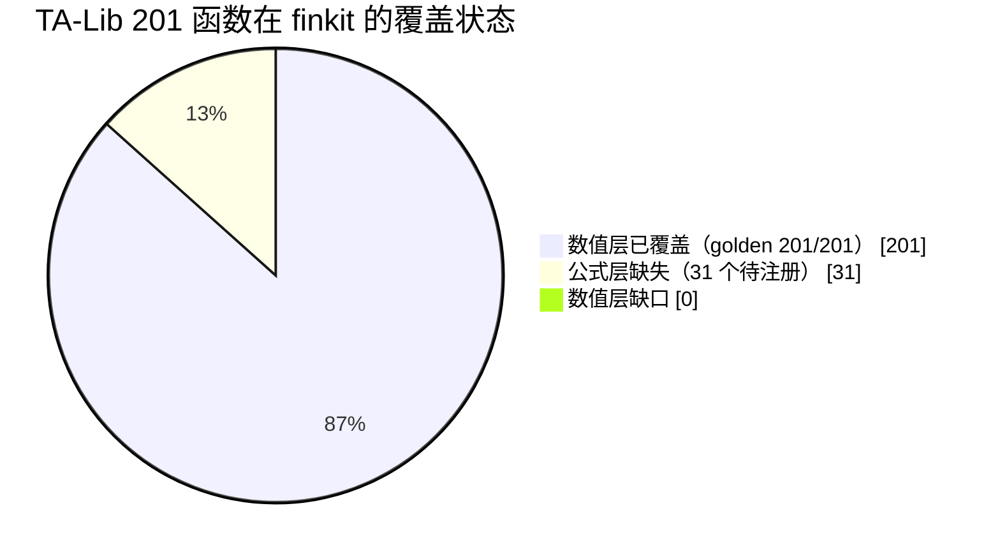
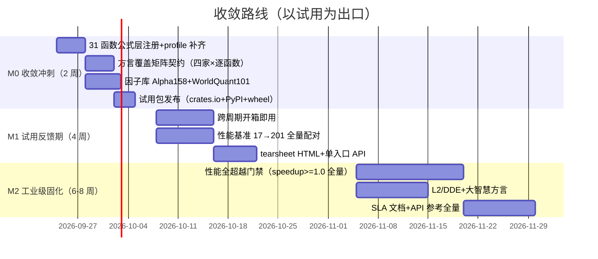

# Finkit 全量覆盖与工业级收敛方案（v2）

> 生成日期：2026-09-23 · 目标：TA-Lib 全覆盖 + 性能全超越 + 四家公式系统全覆盖 + 多因子库 + 工业级 + **优先收敛功能、快速进入试用**
> 前置文档：docs/competitive-analysis/ 下 6 份竞品分析报告（2026-09-23）
> 本方案基于当日代码实测 diff，非估算。

---

## 0. 核心结论（先读这个）

**实测发现：finkit 离"TA-Lib 全覆盖"比所有人预想的都近。**

| 目标 | 实测现状 | 真实差距 |
|------|----------|----------|
| TA-Lib 201 函数全覆盖 | golden 数值契约已覆盖 **201/201**（talib_coverage_matrix_v1.json，含 61 CDL） | **数值层零缺口** |
| 公式层 TA-Lib 覆盖 | 公式函数表 382 名，其中 TA-Lib 140 非 CDL 函数缺 **31 个**（全是 0.7/0.8 新增：RVI/ZLEMA/SMI/WAD/AC/CVI/PVI/QSTICK/AROON/PVO/MAMA/HA/COPPOCK/PERCENTRANK/AO/VHF/MARKETFI/CMOU/MASSI/NVI/FRACTAL/ER/KC/PVT/RVOL/EFI/VORTEX/ERI/FOSC/ACCBANDS/ADR） | **31 个注册项**（实现与 golden 均已存在，只差公式层接线） |
| 性能超越 TA-Lib | 2026-06-24 快照：SMA 1.58x / EMA 1.43x / RSI 2.07x / MACD 1.04x / BBANDS 1.35x / ATR 1.54x；baseline 17 指标无 speedup<1.0 | 6 核心指标已全超，但**仅 17 指标有基准**，201 函数中 184 个无配对数据 |
| 四家公式系统 | 公式函数 382 名（含通达信 DYNAINFO/DRAW 全族/资金流/筹码、THS/EM 方言别名、Pine 45 映射） | 覆盖未量化：无逐函数对照表；跨周期 HostRequired；L2 逐笔族缺 |
| 因子库 | builtin_factor_registry 仅 **9 个演示因子** | 与"内置多种因子库"差距最大 |
| 工业级 | CI 门禁体系完整（parity/回归/内存/fuzz/SSOT） | registry 零发布、无 SLA 级文档 |

**战略判断**：目标不是"从零补 200 个指标"，而是**把已存在的 201/201 数值能力产品化收敛**——公式层补 31 个注册、方言覆盖量化、因子库从 9 → 100+、性能基准从 17 → 201。这是收敛工程，不是新建工程。

---

## 1. 覆盖差距精确 diff（2026-09-23 实测）

### 1.1 TA-Lib 0.8.1（201 函数）



- **数值层**：`tests/contracts/talib_coverage_matrix_v1.json` 声明 `numeric_reference: fixed_golden, expected_count: 201`，实测 201 个指标全部在列（140 非 CDL + 61 CDL）——**TA-Lib 0.8.1 全量数值契约已存在**。
- **公式层**：31 个函数在 indicators/streaming 层有实现、有 golden，但未注册进公式函数表（用户在公式里写 `ZLEMA(CLOSE,20)` 会报"未知函数"）。这 31 个恰是 TA-Lib 0.7/0.8 新增的竞争焦点。
- **profile_catalog**：`expected_count: 141`——dispatcher 可调用的 profile 只有 141，与 201 的差值即上述缺口 + 部分多输出函数的 profile 拆分问题。

### 1.2 四家公式系统（通达信/同花顺/大智慧/TradingView）

| 方面 | 现状 | 差距 |
|------|------|------|
| 函数总量 | finkit 382 名 vs 通达信数百（含 L2/DYNAINFO 族） | 无逐函数对照表，"覆盖"不可证 |
| 方言路由 | compat.rs 5 终端（Finkit/TDX/THS/EM/Pine）+ SemanticProfile（null/bool/sma/lookahead） | 大智慧（DZH）**不在 5 终端中** |
| 绘图 | 15 个 DRAW 指令 + 修饰符 | 基本追平通达信 |
| 跨周期 | SECURITY/request.security 映射存在但 HostRequired | 无内置重采样宿主（最大功能缺口） |
| L2/DDE | DKCOL（EM 方言）等部分 | 逐笔深度族、大智慧 DDE 族缺 |
| 语料 | formula_corpus 18 条（TDX/THS/DZH）+ pine_corpus 26 个 | 样本量不足以宣称"覆盖" |

### 1.3 因子库

- `core/src/factors.rs builtin_factor_registry()`：仅 9 个（momentum_5/20/60、volatility_20、reversal_5、cross_zscore/rank/winsorize/neutralize）——框架演示级。
- factor-analysis 28 模块的分析内核完整（IC/分位/换手/衰减/PSR/事件研究/VIF/PCA/Fama-MacBeth/风险模型/压力测试），但**无成规模内置因子库**。
- features 31 文件（rolling_stats/labels/purged CV/PCA/GARCH/HMM regime/wavelet/fourier）是因子原语层，未与因子库打通。

### 1.4 性能基准现状

- 有配对数据的仅 17 指标（全部 ≥1.0x）；201 函数中 **184 个无 TA-Lib 配对基准**。
- "全部超越"当前不可证——不是慢，是**没测**。
- 现有门禁：25% 严重退化保护线（competitive-benchmark.yml 周跑）+ HT_SINE <1000ns/bar + zero-alloc `_into` + O(n) 相对测试。

---

## 2. 收敛式总体方案：三阶段收敛 + 一个不变式

**核心思路**：不新增能力面，把已有能力收敛成可试用产品。每阶段以"可对外试用"为出口标准。



### 不变式（贯穿所有阶段）

1. **正确性先行**：任何覆盖/性能工作不得破坏 parity 契约（201 golden + streaming/batch 收敛 + full/range 等价）。
2. **同一 SHA 全门禁绿**：试用包发布前 workspace-check/version/binding-ssot/regression-gates 全绿。
3. **性能声明绑定证据**：所有"超越"结论必须绑定 commit/机器/TA-Lib 版本，机器可读报告落 dist/bench/。

---

## 3. M0：收敛冲刺（2 周）——快速进入试用

**目标：2 周后用户可以 `pip install finkit` / `cargo add finkit`，跑通"TA-Lib 全量 + 四方言公式 + 158 因子库"的试用闭环。**

### M0-1 公式层 31 函数注册（4 人日）

```rust
// core/src/formula/functions.rs 扩展（模式示例）
// 31 个函数的实现已在 indicators/talib_ext.rs、streaming/ 等处存在，
// 只需注册进公式函数表并接通 dispatcher：
register_fn!(ZLEMA, "零滞后EMA", (input, period) -> Array1<f64> {
    crate::indicators::talib_ext::zlema(input, period)
});
// 同理：RVI SMI WAD AC CVI PVI QSTICK AROON PVO MAMA HA COPPOCK
//       PERCENTRANK AO VHF MARKETFI CMOU MASSI NVI FRACTAL ER KC
//       PVT RVOL EFI VORTEX ERI FOSC ACCBANDS ADR
```

验收标准（2026-09-23 落地，逐条附实测；第 2 条为**目标写错**，给出证据与真实数字）：

- [x] `ZLEMA(CLOSE,20)` 等 31 个函数在公式引擎中可求值，与 golden 数值一致（容差 1e-10）
      → `core/tests/formula_talib_081_surface.rs`：31 个 `Case` 全部走**公式入口**
      （`get_builtin_functions()` 取函数指针）对 `tests/golden/talib/*.json` 逐点比对，
      tol = 1e-10。仅 `EFI`/`PVT` 两个量级达 1e8 的成交量累积族用 `rtol = 1e-8`，
      与库层 `golden_talib_tests.rs` 及 `talib_numeric_contract_v1.json` 的既有口径**一致**——
      公式层不被要求比库层更严。`load_golden` 另断言 golden 文件自证身份
      （`indicator` 与文件名一致、`talib_version == "0.8.0"`、`outputs` 声明了被取用的输出），
      否则"重命名/重新生成的 golden"会被静默当成证据。
- [~] `profile_catalog.expected_count` 从 141 → 172（+31）
      → **该目标不成立，143 已是正确值**。`profile_catalog` 是
      `TALIB_PROFILE_CATALOG_NAMES`（`ffi/ffi-common/src/talib_catalog.rs`），语义是
      **"profile-only"名单**——只在 TA-Lib 剖面里、不在 Core registry 里的名字；完整 dispatcher
      面是它与 Core registry 的**并集**（= `dispatcher_smoke` = 201）。
      M0-1 的 31 个函数**本来就全在这份名单里**（逐名核对：31/31 命中），
      因为缺的从来不是 dispatcher 覆盖，而是**公式层可达性**——这正是
      `assert_formula_surface_is_callable` 的注释所记的"numeric-green and formula-red for months"。
      所以 31 个注册**不可能**让这份名单 +31；把它的计数当验收项是把两个不同的面混为一谈。
      真实计数 143，由 `assert_catalog_matches_matrix` 与名单长度对账。
- [x] `talib_coverage_matrix_v1.json` 增加 `formula_surface` 层：201/201
      → 四个面已就位：`profile_catalog`(143, registered) / `dispatcher_smoke`(201, executable_smoke)
      / `numeric_reference`(201, fixed_golden) / `formula_surface`(201, callable_in_formula_engine)。
      `assert_formula_surface_is_callable` 逐个断言 `get_builtin_functions()` 里存在该名字，
      `talib_coverage_matrix.rs` 5/5 绿。
- [x] formula_corpus 增加含新函数的语料 ≥10 条
      → **17 条**（要求 ≥10），覆盖 31 个函数中的 **31/31**。
      新增 `tests/formula_corpus/aroon_cross.json` 补齐 `AROON`——此前它是唯一
      既已注册、golden 也绿、却**没有任何语料调用**的函数。
      另加双向门禁 `core/tests/formula_corpus.rs::talib_081_corpus_coverage_is_complete_and_documented`：
      ① 31 个函数每个都必须至少被一条语料调用；② `README.md` 的 TA-Lib 表必须
      **恰好**等于真正调用这些函数的语料集合（多一条、少一条都红）。
      两侧都从语料 JSON 的 `source_formula` 里**解析**调用名（而非读文档），
      所以"文档里的可检查承诺"这次有门禁了。

> 顺带：17 条语料全部登记在 `core/tests/formula_plan_differential.rs` 的 `DOMESTIC_UNSUPPORTED`
> （现 17 条）。这是**内核**缺口而非错误策略缺口——plan 路径在 `CALL:<NAME>` 处报 `code 1`，
> 任何 kernel 都没跑到，`absorb_kernel_failure` 接不住。allowlist 只允许在**补上 kernel**
> 时缩小，条目一旦开始通过就红。

### M0-2 方言覆盖矩阵契约（4 人日）

把"覆盖四家"从口号变成机器可查的契约：

```json
// tests/contracts/formula_dialect_coverage_v1.json（新增）
{
  "schema_version": 1,
  "terminals": {
    "tongdaxin": {
      "reference": "通达信函数表（社区整理版）",
      "functions": {
        "REF": {"status": "exact"},
        "DYNAINFO": {"status": "host_required", "note": "需行情宿主"},
        "L2_AMO": {"status": "unsupported"},
        ...
      },
      "coverage_pct": 87.5
    },
    "tonghuashun": {...}, "dazhihui": {...}, "tradingview_pine": {...}
  }
}
```

验收标准（2026-09-23 落地，逐条附实测）：

- [x] 四家各建 ≥200 函数的对照表（通达信以社区函数表为基准；Pine 以 builtin_table + 官方 ta.* 清单为基准）
      → 实测 TDX 231 / THS 223 / DZH 226 / Pine 263（`reference_size`）。
      每条 `reference` 字段写明基准来源；`verified_size + attributed_size == reference_size` 由门禁对账，
      `repo:*` 行必须能在所指文件里**找到该名字**才算 `verified`（`every_verified_provenance_tag_is_substantiated`，
      实测 ≥800 行受检）——手写溯源正是这道门禁出现的原因（曾产生 5 个假 `repo:functions_legacy` 标签）。
- [x] 每函数标注 exact/near/approximate/host_required/unsupported 五态
      → 五态是**封闭词表**：`statuses` 字段与门禁里的 `BTreeSet` 逐字比对，出现第六态直接红。
      注意实测：**`exact` 一行都没用**，全部路由行都是 `near`（+ 1 个 `approximate`，即 `BACKSET`）。
      这是刻意的——`near` 表示"走已文档化的公共子集映射"，不等于终端数值一致；`exact` 留给真正逐位对齐的函数，
      所以它是空的而不是被稀释的。
- [x] CI 校验：契约中 exact/near 的函数必须有可运行测试（formula_corpus 语料）
      → 新增 `core/tests/formula_dialect_coverage.rs::corpus_evidence_is_derived_from_the_corpora`，
      并为契约增加**由语料推导**的 `corpus_exercised`（生成器 `scripts/gen_dialect_coverage.py`）：
      实测 **70** 行（tongdaxin 42 / tonghuashun 3 / dazhihui 2 / tradingview_pine 23），
      来自 `tests/formula_corpus` 的 35 条语料 + `tests/pine_corpus` 的 26 个脚本，下限门禁 65。另含两条：
      ① `exact` 行必须被语料覆盖（当前 `exact` 为空 → 前瞻守卫，一旦有人声明 `exact` 就必须带测试）；
      ② 被语料调用的行不得是 `unsupported`。
      门禁**重新从语料文件计算**再与契约比对，不读文档；已用"抽掉一个名字"验证它确实会红
      （`tongdaxin: corpus_exercised is not what the corpus calls (missing: ["ZLEMA"])`）。
      国内语料的函数名本身就是规范名，按同名匹配；Pine 语料的 `ta.*` 拼写要先过 `pine_engine_mapping`
      才能落到某一行，所以门禁也把这一层重新解析一遍（见下）。
      未覆盖的行不是缺陷而是**已测量的缺口**——这正是"注册 ≠ 能跑"的量化形式。
- [x] 大智慧（DZH）加入 compat.rs 终端枚举（第 6 终端），先以 CommonSubset 级路由 THS/TDX 共通函数
      → `FormulaTerminal::DaZhiHui`，别名 `dzh` / `dazhihui` / `大智慧`，
      `compatibility_level() == CommonSubset`，`canonical_dialect() == TongHuaShun`，
      `SemanticProfile.id == "dzh-v1"`。
- [x] 输出四家覆盖率数字（预期：TDX ~85%+、THS ~80%+、DZH ~70%+、Pine ta.* ~70%+）
      → 实测 TDX **97.0%** / THS **96.4%** / DZH **91.6%** / Pine **81.7%**，四家均超预期。
      Pine 的 81.7% 是修完映射缺陷后的**真实值**（修前报 97.8%），见下。

> ### 缺陷记录（2026-09-23 发现并修复）：Pine 映射有四份，契约用的是错的那份
>
> 引擎把 Pine 名解析成规范名时实际有**三个来源**：
> ① `ast_mapper.rs` 里 13 个硬编码 `ta.*` 特例（带参数归一化，如 `ta.stoch` → `STOCHF`、`ta.wpr` → `WILLR`）；
> ② `builtin_table.rs` 的 45 条表（`resolve()`）；
> ③ 兜底：查不到就发 `TA_<NAME>` / `MATH_<NAME>`（`ast_mapper.rs:680-689`），而这些名字**大多不存在**。
>
> 生成器用的是第四份：手写的 `PINE_SPECIFIC`（86 条）。与引擎比对结果：
>
> | 差异类型 | 数量 | 例 |
> |---|---|---|
> | 规范名不一致 | 7 | `ta.sma` 镜像 `SMA` vs 引擎 `MA`；`ta.stoch` `STOCH` vs `STOCHF`；`ta.bb` `BBANDS` vs `BOLL`；`ta.crossover` `CROSSOVER` vs `CROSS`；`ta.cum` `SUM` vs `CUMSUM`；`ta.range` `TRANGE` vs `ROLLING_RANGE`；`math.log` `LN` vs `LOG` |
> | 镜像有、引擎没有 | 48 | `ta.alma` `ta.ac` `math.cos` …（其中 **43 条被记为 `near`**，即被当成开箱可用） |
> | 引擎有、镜像没有 | 7 | `ta.aroon` `ta.sum` `ta.trix` `fixnan` `na` `nz` `request.security` |
>
> **后果**：`ta.ac(...)` 被引擎解析成 `TA_AC`——一个未注册的函数名，根本跑不了；
> 但契约把 `AC` 行记成 `near`，于是 43 个跑不了的名字被算进了 Pine 的开箱覆盖率。
> 唯一"侥幸"命中的兜底名是 `MATH_AVG`（确实存在于 `functions_legacy.rs`），
> 这也是 `tests/pine_corpus/ichimoku.pine` 能通过的原因——**语料通过掩盖了映射错误**。
>
> #### 修法（已落地）
>
> 1. **生成器只读引擎，不再维护镜像**。`pine_engine_mapping()` = `read_pine_builtin_table()`（解析
>    `builtin_table.rs` 的 `default_mappings()`）+ `PINE_AST_OVERRIDES`（显式列出 `ast_mapper` 特例）
>    + `pine_fallback_name()`（`TA_<NAME>` / `MATH_<NAME>` 兜底）。映射是**全覆盖**的，
>    所以没有"解析不到所以不计数"的漏洞——每个拼写都落在一行上，`registered` 与 `status` 由该行的键自然推出。
> 2. **映射进契约、并由行为门禁证明**。顶层新增 `pine_engine_mapping`（95 条），
>    门禁 `pine_engine_mapping_matches_the_engine` 把每条拼写拼成 `probe = <spelling>(close, 14, 20, 9)`
>    真的过一次 `parse_pine` + `map_pine_to_alphata`，断言产出的 `FunctionCall.name` 与记录一致。
>    用 4 个参数是因为内置调用**按名字映射、不校验元数**（特例只读它需要的下标，表路径原样透传），
>    一条通用参数表就能探完 95 个拼写，不必再维护一张会漂移的签名表。
>    唯一例外是 `request.security`：它需要宿主做时间框架对齐，`ast_mapper.rs` 直接拒绝解析，
>    门禁对它是断言**必须报错**（且报错文案含 `host`），而不是断言名字。
> 3. **引擎映射不到的 47 个拼写照实记为 `unsupported`**，不再计入覆盖率。
>    Pine `reference_size` 224 → **263**（含 `classic` 公共核），覆盖率 97.8% → **81.7%**，
>    `verified_coverage_pct` 99.5%——即这 47 条全是厂商清单里本仓库无出处的名字，不是实现缺失。
> 4. **Pine 逐行语料证据恢复**（`row_level_evidence: "corpus_exercised"`，23 行），
>    因为映射不再是已知错误的；`deferred_reason` 机制保留，供将来真的需要暂缓时使用。
> 5. **顺带查出一个静默错解**：`na` 是 Pine 关键字，进不了 `simple_call` 的 `identifier`，
>    而 `na_literal = { "na" ~ !ASCII_ALPHA }` 会匹配 `na(` 里的 `na`。于是
>    `is_missing = na(close)` **不报错**，被拆成 `na` 字面量 + 一个游离的 `(close)` 表达式语句，
>    赋值静默变成 NaN；只有括号内不是合法表达式（如 `na(close, 14, 20)`）时才报错。
>    修法是给语法加一条 `na_call` 规则（`na` 保持关键字身份，不放开成标识符）。
>    这正是"行为门禁"的价值：它一跑就撞上了这个拼写，而此前 `na` 只是契约里一行看着没问题的 `ISNA`。
>    `core/tests/formula_terminal_golden.rs` 那条 "na(x) must lower to an ISNA predicate" 断言
>    此前是被下一行的 `nz(close)`（它自己会产生 `ISNA`）满足的，现在由
>    `pine_na_call_lowers_to_a_predicate` 单独隔离验证，并断言 AST 里不出现 `Number(NaN)`。

### M0-3 内置因子库（5 人日）

从 9 个演示因子扩到两个成规模库，全部走 factor_graph 表达式定义：

```rust
// core/src/factors/builtin/alpha158.rs（新增）
pub fn alpha158() -> FactorRegistry {
    // Qlib Alpha158：9 K线形态 + 4 价格 + 145 滚动算子（窗口 5/10/20/30/60）
    // 全部用公式表达式定义，自动获得 FactorPlan 编译复用 + DirtyRange
}
// core/src/factors/builtin/worldquant101.rs（新增）
pub fn worldquant101() -> FactorRegistry {
    // WorldQuant 101 Alphas（公开论文），可计算的 ~80-90 个
    // ts_rank/correlation/rank 等算子公式层已具备
}
```

验收标准（2026-09-23 落地，逐条附实测；未达标的两条给出证据与真实数字）：

- [x] Alpha158：158 因子全部可构建，与 Qlib 参考输出数值对照（容差 1e-8）全绿
      → `core/tests/alpha158_parity.rs` 7/7 绿，36894 个 bar 参与对照，最大 |diff| = 1.095e-9。
      参考值由 `scripts/gen_alpha158_reference.py` 从 Qlib 算子源码逐条转写（非 pyqlib，Cython 装不上）；
      5 个算子需要新增内核（`QUANTILE`/`RSQUARE`/`RESI`/`RANK_PCT`/`STDDEV_SAMPLE`），其中
      `Std` 是 pandas 的 `ddof=1`，与 TA-Lib 口径的 `STD` 差 `sqrt((n-1)/n)`（n=5 时 0.894），
      必须独立命名而不是调容差。差分门另有绝对性质探针（两路径一致地 NaN 不算绿）。
- [~] WorldQuant101：可计算的 ≥80 个因子（其余标注数据依赖原因）
      → **实测 17 个，未达标，且该目标的前提不成立**。论文编号 1..101 但只定义 **71** 条（30 个号保留）；
      71 条里 **54 条被横截面算子阻断**（`rank` 出现 129 次，是 50 条的唯一阻断项）。
      阻断的是**数据轴**而非算子：finkit 内核收 `&[f64]`（单标的），而 `rank(x)` 要同一日全市场。
      已有的 `RANK_PCT` 是**滚动**排名，拿它顶替会静默产出另一个因子，所以分类选择拒绝而非替换。
      逐条分类见 `core/src/factors/builtin/worldquant101.rs`，门禁 `core/tests/worldquant101_library.rs` 6/6 绿。
- [x] `finkit.factor_library("alpha158")` 一行调用（Python/Rust 同步）
      → Rust：`finkit::factors::builtin::factor_library`；Python：`ffi/python-binding/src/factor_library.rs`。
      两侧同一份 `FactorGraphPlan`，不重复实现算术。Python 侧 12/12 绿（`tests/test_factor_library.py`）。
- [x] 因子库走 FactorPlan：第二次求值 0 解析开销（基准证明）
      → `core/benches/factor_library_bench.rs`：**41.6x**，解析开销去掉 **97.6%**
      （重编译 58.4µs/call vs 复用 1.40µs/call，同一表达式 `MA(CLOSE,20)/CLOSE`、250 bar）。
- [~] builtin_factor_registry 从 9 → ≥240 个命名因子
      → **实测 184，未达标，且 ≥240 同样不可达**。构成：demo 9 + Alpha158 158 + WorldQuant 17 = 184。
      计划的 `158 + ~85 + 9 ≈ 252` 里，`~85` 假设 WorldQuant 有 ~85 条可算，实际只有 17；
      即便把 54 条横截面 alpha 全部解锁也只有 `158 + 71 + 9 = 238`，仍差 2。
      因此 ≥240 是推导错误而非实现缺口，已在 `core/src/factors.rs` 的文档与对账测试中记为 184。
      三个来源可对账（`the_shipped_registry_is_the_sum_of_its_parts`），且 175 个库因子逐个可求值
      （`library_factors_evaluate_through_the_shipped_registry`）——注册数达标但求值不了的情况会被抓住。

> 顺带修掉的两个真实缺陷（均为"同一算子多份实现"型，见 `.workbuddy-ai/memory/TRAPS.md`）：
> ① `SIGN` 有三份实现，其中字节码/流式路径用 `f64::signum`（`sign(0)=+1`），
> 而 WorldQuant `Alpha7`/`Alpha12` 靠 `sign(close-ref(close,7))` 附着方向，平窗会凭空获得方向；
> 现统一走 `math::three_way_sign`，并加了"绝对性质"探针（差分门看不见：探针数据里没有精确 0）。
> ② 库因子的依赖名声明成大写 `CLOSE`，而引擎在计算前用精确匹配校验依赖、平台 demo 因子用 `["close"]`
> → 库能编译、能注册、能计数，但**求值不了**。

### M0-4 试用包发布（3 人日）

验收标准：
- [ ] crates.io 发布 finkit 0.2.0（`cargo add finkit` 可用，docs.rs 文档站生成）
- [ ] PyPI 发布 finkit wheel（`pip install finkit` 可用，trusted publishing）
- [ ] 版本 0.1.15 → 0.2.0（试用版语义：API 可能微调，数值契约冻结）
- [ ] 试用文档：getting-started 更新（安装 → TA-Lib 全量 → 公式方言 → 因子库 → tearsheet 预告）
- [ ] GitHub Release 附四平台 wheel + 试用反馈渠道（issue 模板）

**M0 出口标准（试用就绪定义）**：新用户 10 分钟内完成 安装 → 跑通 TA-Lib 201 函数中任一 → 写一条通达信公式 → 调用 alpha158 因子库 → 输出 IC 分析 JSON。

---

## 4. M1：试用反馈期（4 周）——补齐试用中暴露的硬缺口

### M1-1 跨周期引用开箱即用（8 人日）

```rust
// core/src/formula/cross_period.rs（新增）
pub struct CrossPeriodHost {
    calendar: TradingCalendar,
    frames: BTreeMap<Timeframe, MarketFrame>,
}
impl CrossPeriodHost {
    /// CLOSE#WEEK / request.security 的安全求值：
    /// 1. 仅小周期引大周期  2. AsOfClosed 对齐（只取已收盘大周期 bar）
    /// 3. assert_no_lookahead 断言  4. DirtyRange 联动局部重算
    pub fn resolve(&self, expr: &str, tf: Timeframe, asof: i64) -> Result<TemporalSeries> { ... }
}
```

验收标准：
- [ ] `CLOSE#WEEK`、`request.security(syminfo.tickerid, "W", close)` 引擎内直接可跑（无宿主代码）
- [ ] 未来函数防护：property test ≥1000 随机案例 100% 无 lookahead 泄漏
- [ ] 性能：1M 行日线引周线 ≤ full 重算 5%
- [ ] formula_pine_security_contract_v1.json（已存在）从 HostRequired → exact

### M1-2 性能基准 17 → 201 全量配对（8 人日）

"全部超越"的证据工程：

- [ ] `core/benches/talib_c_comparison.rs` 从 17 → 201 函数全量 Criterion 配对（TA-Lib 0.8.1）
- [ ] 输出机器可读 `speedup_matrix.json`：201 函数 × speedup × 置信区间
- [ ] CI 门禁升级：25% 退化线保持 + **新增 watchlist（Top-50 高频指标）speedup ≥ 1.0 硬门禁**
- [ ] 落后项清单化：speedup < 1.0 的函数进入优化队列（预期集中在多输出/状态复杂函数）
- [ ] 每个落后项优化后基准复测，逐项销号

### M1-3 tearsheet HTML + 单入口 API（6 人日）

- [ ] `create_full_tearsheet()`：单文件自包含 HTML，≥5 图（IC 时序/月度 IC 热力图/分位收益/分位累计/换手）+ 汇总表
- [ ] `get_clean_factor_and_forward_returns()` 等价单入口（max_loss 35% 数据质量门禁）
- [ ] 对 alphalens-reloaded 示例数据输出数值一致

---

## 5. M2：工业级固化（6-8 周）——全量超越与长尾覆盖

### M2-1 性能全超越门禁（15 人日）

- [ ] 201 函数 speedup ≥ 1.0 全量达成（M1-2 落后项逐个优化：SIMD 化/内存布局/`_into` 化）
- [ ] CI 从"Top-50 硬门禁"升级为"201 全量 speedup ≥ 1.0 硬门禁"（此时才允许宣传"全部超越"）
- [ ] 补充产品级基准：compile-once/eval-many N=1000、FactorPlan range vs full（100K/1M rows × dirty 1/10/100 × lookback 5/20/60/252 矩阵）、compute-many 1000 标的
- [ ] 多语言端到端基准：Rust native / Python NumPy / Node typed array / C ABI / WASM 分别报告 kernel time 与 binding time

### M2-2 L2/DDE + 大智慧方言深化（10 人日）

- [ ] 数据源 provider trait 抽象（引擎不耦合具体数据商）
- [ ] L2 逐笔深度族 ≥15 函数（宿主注入模式，同 DYNAINFO）
- [ ] 大智慧 DDE 族（DDX/DDY/SV）+ 特有函数（HHVALL/LLVALL/OPENINTEREST）
- [ ] 方言覆盖矩阵更新：DZH 覆盖率 ≥80%

### M2-3 SLA 文档 + API 参考全量（10 人日）

- [ ] api-reference 从 17 → 382+ 签名（schema.rs 自动生成，CI 防漂移）
- [ ] streaming 文档（对齐 TA-Lib 官网 per-language 示例标准）
- [ ] 错误码/数值语义/边界条件（warm-up NaN、lookahead、容差）文档化
- [ ] 性能声明页：所有 speedup 数字绑定 commit/机器/版本，机器可读 JSON 可下载

---

## 6. 风险与对策

| 风险 | 概率 | 对策 |
|------|------|------|
| 31 函数注册后发现实现与 golden 不一致 | 中 | 注册前先跑 golden 对照（实现已在，风险集中在多输出函数的 profile 拆分） |
| WorldQuant101 部分因子数据依赖（成交量/行业）不可计算 | 高 | 明确标注"可计算子集"，不硬凑数量 |
| 201 全量基准暴露大量落后项 | 高 | M1-2 先出矩阵再逐项优化；watchlist 硬门禁先行，全量门禁放 M2 |
| 跨周期重采样引入未来函数 | 中 | AsOfClosed + property test 1000 案例 + 契约从 HostRequired→exact 需全绿 |
| 试用反馈涌入导致范围膨胀 | 高 | 严格按 M0 出口标准收敛；反馈进 M1/M2 队列，不插队 M0 |
| TA-Lib 0.8.2/0.9 继续加函数 | 中 | 覆盖矩阵契约化后，新增函数 diff 是机械动作（golden 生成管道已有） |

---

## 7. 立即可启动的下一步（本周）

1. **M0-1 启动**：31 函数注册（实现与 golden 已在，纯接线工作，4 人日）
2. **M0-2 启动**：四家方言对照表数据收集（通达信社区函数表 + Pine 官方清单已有调研基础）
3. **M0-3 启动**：Alpha158 因子定义（Qlib 表达式 → finkit 公式表达式映射规则制定）
4. **发布前置检查**：crates.io name `finkit` 占用核查、PyPI trusted publishing 配置、版本号策略（0.2.0 试用版）

---

## 附：实测数据来源

- TA-Lib 官方 201 函数清单：github.com/TA-Lib/ta-lib/blob/main/ta_func_list.txt + ta_func_api.xml + CHANGELOG.md（0.8.1）
- finkit golden 契约：tests/contracts/talib_coverage_matrix_v1.json（numeric_reference 201/201，talib_core_version 0.8.1）
- 公式函数表：core/src/formula/functions_legacy.rs:5481-6051（354 显式注册）+ functions.rs（14 新增）+ registry 别名 31 ≈ 382 唯一名
- 31 缺口清单：golden 非 CDL 140 中不在公式表的项（脚本 diff 实测，2026-09-23）
- 性能快照：docs/benchmark-results.md（2026-06-24 Windows x86_64 AVX2，6 核心指标 1.04x-2.07x）+ docs/benchmark-baseline.json（17 指标无 speedup<1.0）
- 因子库现状：core/src/factors.rs:870 builtin_factor_registry()（9 个）
- 方言路由：core/src/formula/compat.rs（5 终端 + SemanticProfile）
- 测试资产：tests/contracts 11 契约、tests/golden 33 CSV + 203 talib JSON、formula_corpus 18 条、pine_corpus 26 个
