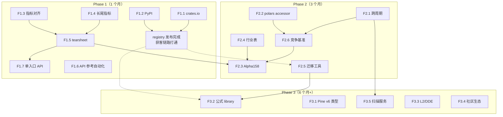

# Finkit 竞争战略与优先级排序

> 生成日期：2026-09-23 · 输入：《finkit-差距分析与战略补足建议书-2026-09-23.md》
> 方法：劣势分级 → 三阶段补足策略（含量化验收标准）→ ROI 四象限排序

---

## 第一部分：劣势诊断与分级

| 劣势维度 | 具体劣势描述 | 对比竞品依据 | 分级 | 技术根因（项目文档/代码依据） | 影响程度 |
|----------|-------------|-------------|------|-------------------------------|----------|
| 发布与分发 | registry 零发布，`pip/cargo add` 不可用 | TA-Lib/Pandas TA/alphalens 均 PyPI 在架 | **致命** | language-bindings.md:121,319-320；installation.md:129 | 高 |
| 指标数量与口径 | 150+ vs 200+/284；口径混乱（150 指标 vs 320 公式函数） | TA-Lib 0.8.1（+40）、Pandas TA 284 | **致命** | README.zh-CN.md；functions_legacy.rs:5481（314 函数） | 高 |
| 跨周期引用 | HostRequired 无默认宿主，不可开箱即用 | 通达信 `#`、Pine request.security | 重要 | compat.rs:478；data_contract.rs/calendar.rs 组件闲置 | 高 |
| 因子产品形态 | 无 tearsheet HTML、无单入口 API、无行业表 | alphalens create_full_tear_sheet | 重要 | report.rs:71 仅 JSON；visualization crate 零接线 | 中高 |
| Polars 互操作 | 8 方法薄封装，非 accessor/零拷贝 | TA-Lib wrapper 原生 Polars、Pandas TA `df.ta` | 重要 | polars_ext/series_ops.rs:7-14 | 中高 |
| API 文档 | 17 签名 vs 320 函数（~5%） | TA-Lib 全函数文档 | 重要 | api-reference.md（1043 行 50 节） | 中 |
| 长尾风险指标 | 缺 kelly/aggregate/rolling 族等 | empyrical、quantstats 100+ | 次要 | risk.rs 7 函数、returns.rs 6 函数 | 中 |
| Pine v6 能力 | 仅 v5 子集，无 UDT/library | Pine v6 类型系统 | 次要 | pine/builtin_table.rs 45 映射 | 中 |
| L2/DDE 函数族 | 逐笔深度族缺失 | 通达信 L2、大智慧 DDE | 次要 | functions_legacy.rs:498 仅 DKCOL | 低 |
| 生态迁移工具 | 无脚本迁移工具/社区内容 | Pine 10 万脚本生态 | 次要 | docs/ 无迁移工具 | 中（长期高） |

---

## 第二部分：补足策略与时间线

### Phase 1（短期，1 个月内）：低垂果实

| 功能 | 验收标准（量化） | 技术实现 | 对应劣势 |
|------|------------------|----------|----------|
| **F1.1 crates.io 发布** | `cargo add finkit` 在 Rust 1.85+ 可用；docs.rs 自动生成文档站；CI 含 `cargo publish --dry-run` 门禁 | 新增 publish.yml workflow（tag 触发）；核对 crates.io name 占用；workspace metadata 已齐 | G1 |
| **F1.2 PyPI 发布** | `pip install finkit` 在 cp38+ 四平台可用；PyPI trusted publishing（无 token 泄漏面）；版本与 GitHub Release 同步 | maturin publish --skip-existing 复用现有 abi3 wheel 矩阵；id-token: write 权限 | G1 |
| **F1.3 指标对齐 0.8.1** | TA-Lib 0.8.1 新增 40+ 指标 parity 测试全绿（max_abs ≤ 1e-10）；README 口径改为"200+ 指标 + 320 公式函数"双口径；indicator_registry.json 快照同步 | 复用 streaming/ 已有实现（supertrend/donchian/vortex）对齐命名；MaType 扩展 HMA/ZLEMA/RMA；golden vector 基础设施 | G2 |
| **F1.4 长尾指标** | 新增 ≥10 个指标函数（kelly/aggregate_returns/cum_returns_final/rolling_sharpe/rolling_vol/rolling_beta/gain_to_pain/payoff_ratio/profit_factor/consecutive_wins_losses）；每个带单元测试与 empyrical/quantstats 数值对照 | risk.rs/returns.rs/performance.rs 扩展；rolling 族复用 features/rolling_stats.rs | G7 |
| **F1.5 tearsheet HTML** | `create_full_tearsheet()` 输出单文件自包含 HTML（无外部依赖）；含 ≥5 图（IC 时序/月度 IC 热力图/分位收益/分位累计/换手）+ 1 汇总表；对 alphalens-reloaded 示例数据输出结果数值一致 | report.rs 调 visualization crate；数据源为 analysis.rs 已有 JSON 中间态 | G4 |
| **F1.6 API 参考自动化** | api-reference.md 覆盖率从 17 → 320+ 签名（≥95% 公式函数）；CI 校验文档与 registry 同步（防漂移） | 从 schema.rs/FunctionApiSchema 生成；复用 finkit-schema bin | G6 |
| **F1.7 单入口 API** | `get_clean_factor_and_forward_returns()` 等价 API 发布；对 alphalens 同名 API 的输入输出做兼容映射文档；max_loss 式数据质量门禁（默认 35%） | prepare+data 模块包装 | G4 |

### Phase 2（中期，3 个月内）：架构升级

| 功能 | 验收标准（量化） | 技术实现 | 对应劣势 |
|------|------------------|----------|----------|
| **F2.1 跨周期开箱即用** | `CLOSE#WEEK` 与 `request.security` 在引擎内直接可跑（无宿主代码）；未来函数防护：AsOfClosed 对齐断言 100% 通过（property test ≥1000 随机案例无 lookahead 泄漏）；性能：1M 行日线引周线 ≤ full 重算的 5% | parser.rs 加 `#TF` 语法；CrossPeriodHost 内置重采样（calendar+data_contract）；DirtyRange 联动 | G3 |
| **F2.2 polars accessor** | `df.ta().*` 覆盖 ≥150 指标；零拷贝路径基准：contiguous chunk 直读比拷贝路径快 ≥20%（benches 固化）；Polars 0.46 兼容 | indicator! 宏生成全指标；ChunkedArray as_slice 直读；benches 新增 polars 路径 | G5 |
| **F2.3 Alpha158 因子库** | 158 因子全部可用 `factor_analysis::builtin::alpha158()` 一次构建；与 Qlib Alpha158 参考值数值对照（容差 1e-8）全绿；单因子计算走 FactorPlan 编译复用（第二次求值 0 解析开销） | factor_graph 表达式定义；golden 对照 Qlib 输出 | G4 |
| **F2.4 行业分类表** | 内置申万一级（31 行业）+ 中信一级映射；`group_adjust`/`binning_by_group` 可直接按行业分组；行业表可热更新（不锁死在 crate 版本） | data.rs add_group 扩展；静态表 + 更新通道 | G4 |
| **F2.5 迁移工具** | `finkit migrate tdx ./tn6` 解析成功率 ≥95%（对 100 个真实通达信公式样本）；输出兼容性报告（支持/部分/不支持+原因）；Pine 同理（100 样本） | tn6/tne 解析器 → AST 映射 → compat 报告；复用 formula_corpus 测试基建 | G10 |
| **F2.6 竞争基准** | compile-once/eval-many：N=1000 次求值 vs 逐次 parse 的加速比报告（机器可读 JSON）；FactorPlan range vs full：100K/1M rows × dirty 1/10/100 × lookback 5/20/60/252 全矩阵；DirtyRange recomputed_rows/total_rows 契约断言 | benches 扩展；对齐 competitive-positioning-zh.md §8 | G2 |

### Phase 3（长期，6 个月以上）：护城河构建

| 功能 | 验收标准（量化） | 技术实现 | 对应劣势 |
|------|------------------|----------|----------|
| **F3.1 Pine v6 类型子集** | UDT/方法/枚举解析+静态类型检查可用；对 Pine v6 官方示例 ≥80% 可解析执行；类型错误在编译期报出（非运行时） | parser/AST 扩展；contracts.rs 静态校验深化 | G8 |
| **F3.2 公式 library** | 跨公式 import 语法（`import finkit.lib/mylib@1.2`）；版本化+语义化版本约束；library 缓存与 FormulaCache 联动 | templates.rs+custom.rs 演进；注册表设计 | G8/G10 |
| **F3.3 L2/DDE 函数族** | L2 逐笔深度族 ≥15 函数（依赖数据源抽象层）；DDE 族（DDX/DDY/SV）大智慧方言路由 | 数据源 provider trait 设计（避免引擎耦合具体数据商） | G9 |
| **F3.4 社区生态** | 100 个常用公式模板库；10 个迁移案例（通达信/Pine → finkit 全过程）；教程系列（getting-started → 因子研究全链路） | docs/ + examples/ 持续建设 | G10 |
| **F3.5 扫描服务形态** | compute-many：1000 标的 × 1 公式并发求值，共享中间结果；CLI `finkit scan` 子命令；吞吐基准（标的数/秒） | batch.rs run_parallel + FormulaPlanCache 共享 | G3 延伸 |

---

## 第三部分：功能开发要点排序（ROI 四象限评估）

### 3.1 四象限功能分布表

| 功能名称 | 痛点等级 | 成本估算 | 所在象限 |
|----------|----------|----------|----------|
| F1.1 crates.io 发布 | 高 | 2 人日 | **第一优先级** |
| F1.2 PyPI 发布 | 高 | 2 人日 | **第一优先级** |
| F1.4 长尾风险指标 | 高 | 2 人日 | **第一优先级** |
| F1.5 tearsheet HTML | 高 | 5 人日 | **第二优先级** |
| F1.3 指标对齐 0.8.1 | 高 | 5 人日 | **第二优先级** |
| F1.6 API 参考自动化 | 中 | 3 人日 | **第四优先级** |
| F1.7 单入口 API | 中 | 2 人日 | **第三优先级** |
| F2.1 跨周期开箱即用 | 高 | 10 人日 | **第二优先级（分阶段）** |
| F2.2 polars accessor | 中高 | 8 人日 | **第二优先级** |
| F2.3 Alpha158 因子库 | 中 | 6 人日 | **第四优先级** |
| F2.4 行业分类表 | 中 | 3 人日 | **第四优先级** |
| F2.5 迁移工具 | 中高 | 8 人日 | **第二优先级** |
| F2.6 竞争基准 | 中高 | 5 人日 | **第四优先级** |
| F3.1 Pine v6 类型 | 中 | 30 人日 | 第五优先级 |
| F3.2 公式 library | 中 | 20 人日 | 第五优先级 |
| F3.3 L2/DDE 函数族 | 低 | 15 人日 | 第五优先级 |
| F3.4 社区生态 | 中（长期高） | 持续 | 第五优先级 |
| F3.5 扫描服务形态 | 低 | 15 人日 | 第五优先级 |

### 3.2 最终开发优先级排序

| 排序 | 功能名 | 象限 | 工时 | 排序理由 |
|------|--------|------|------|----------|
| 1 | F1.1 crates.io 发布 | 第一 | 2d | 获客链路前提；ta crate 真空（年 7.5 万下载）以月计关闭；成本最低 |
| 2 | F1.2 PyPI 发布 | 第一 | 2d | 同上；Python 是量化第一语言，`pip install` 是选型第一入口 |
| 3 | F1.4 长尾风险指标 | 第一 | 2d | 2 人日把 empyrical/quantstats 覆盖 90%→98%；tearsheet 的数据依赖 |
| 4 | F1.3 指标对齐 0.8.1 | 第二 | 5d | 数量追平 200+ 消除选型第一过滤器劣势；多数实现已存在，属收尾 |
| 5 | F1.5 tearsheet HTML | 第二 | 5d | 产品形态质变；组件全闲置，接线即得；alphalens 用户迁移的直接钩子 |
| 6 | F2.1 跨周期开箱即用 | 第二（分阶段） | 10d | 最大功能缺口；可代际超越（安全对齐 vs 通达信未来函数风险）；分两期：语法糖+宿主（6d）→ DirtyRange 联动（4d） |
| 7 | F2.2 polars accessor | 第二 | 8d | Polars 3000 万月下载生态位；TA-Lib 刚入场，并列窗口有限 |
| 8 | F2.5 迁移工具 | 第二 | 8d | 获客杠杆：量化方言覆盖率的同时产出兼容性报告资产 |
| 9 | F1.7 单入口 API | 第三 | 2d | 降低 alphalens 用户心智成本；依赖 F1.4/F1.5 完成后价值最大 |
| 10 | F1.6 API 参考自动化 | 第四 | 3d | 消除能力不可见；registry 基建已有，自动化后维护成本趋零 |
| 11 | F2.6 竞争基准 | 第四 | 5d | 把架构优势变成选型证据；依赖 F2.1/F2.2 完成后数字更完整 |
| 12 | F2.3 Alpha158 因子库 | 第四 | 6d | 高感知差异化；依赖 F2.6 基准展示 FactorPlan 复用收益 |
| 13 | F2.4 行业分类表 | 第四 | 3d | 补齐 alphalens 对标最后一块；数据维护是长期成本 |
| 14 | F3.2 公式 library | 第五 | 20d | 生态飞轮基础设施；依赖用户基数（F1.1/F1.2）先到位 |
| 15 | F3.1 Pine v6 类型 | 第五 | 30d | 生态上限方向；工程量最大，等核心场景站稳后投入 |
| 16 | F3.4 社区生态 | 第五 | 持续 | 长期护城河；随各阶段交付持续沉淀 |
| 17 | F3.5 扫描服务形态 | 第五 | 15d | 通达信选股器的引擎层等价物；依赖跨周期（F2.1）先行 |
| 18 | F3.3 L2/DDE 函数族 | 第五 | 15d | 依赖数据源接入，非引擎问题；国内深度行情场景边际收益 |

### 3.3 关键路径分析

关键依赖链：
1. **F1.4 → F1.5 → F1.7**：长尾指标是 tearsheet 汇总表的数据依赖，tearsheet 是单入口 API 的展示层
2. **F2.1 + F2.2 → F2.6**：竞争基准应在跨周期与 polars 就绪后出完整数字（否则要重跑）
3. **F2.6 → F2.3**：Alpha158 的价值展示依赖 FactorPlan 复用基准数字
4. **registry 发布（F1.1/F1.2）→ 迁移工具/公式 library**：没有安装路径，迁移工具与生态建设无意义

---

## 总结

**战略主线**：先通分发（4 人日撬动获客链路），再接线三质变（tearsheet/跨周期/polars，23 人日兑现组件齐全但未交付的产品形态），最后用基准数字显性化架构优势（10 人日把 Quant Compute Runtime 从叙事变成证据）。

**资源分配建议**：Phase 1 共 ~21 人日（1 人 1 个月），Phase 2 共 ~40 人日（1 人 2 个月或 2 人 1 个月），Phase 3 按用户反馈动态投入。若资源受限，**最低可行组合是 F1.1 + F1.2 + F1.3 + F1.5（14 人日）**——发布打通 + 数量追平 + tearsheet，即可参与标准选型对比。

**风险提示**：TA-Lib 0.8.2 开发中，若其继续补齐公式/因子能力（可能性低，架构不符），finkit 的差异化窗口将进一步收窄；kand/AKQuant 在 Rust TA 赛道的活跃度是持续监测项，建议每季度复核竞品动态（复用本报告调研框架）。
