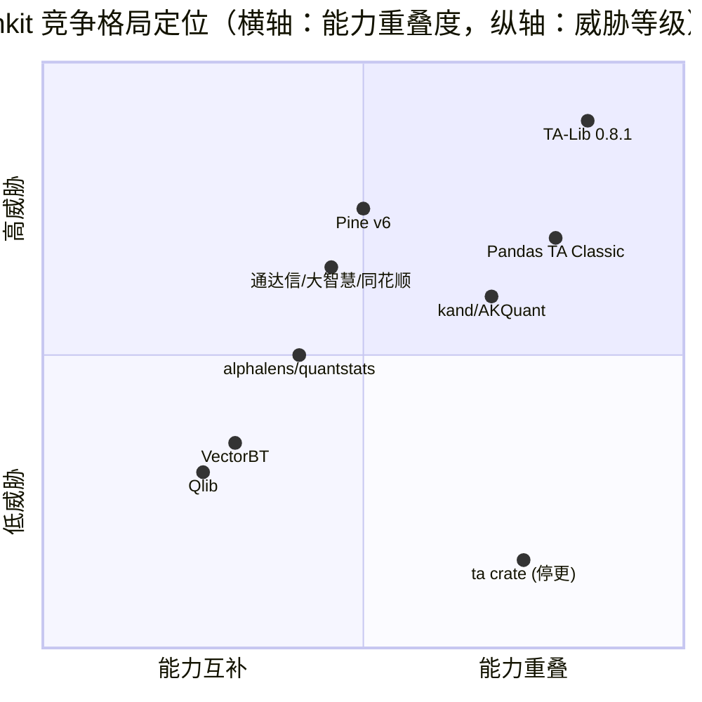

# 竞品综合对比总览

> 生成日期：2026-09-23 · 汇总三份深入分析报告（计算库 / 公式系统 / 因子研究）
> 详细依据见同目录：《计算库竞品深入分析》《公式系统竞品深入分析》《因子研究竞品深入分析》

---

## 1. 竞品对比总览表

| 对比维度 | finkit v0.1.15 | TA-Lib 0.8.1 | Pandas TA 0.8.32 | VectorBT 1.1.0 | 通达信 | Pine v6 | alphalens-reloaded | quantstats |
|----------|----------------|--------------|-------------------|-----------------|--------|---------|---------------------|------------|
| **定位** | Quant Compute Runtime | 指标函数库 | 指标函数库 | 回测研究产品 | 行情+公式 | 图表+公式 | 因子 tearsheet | 业绩报表 |
| **语言** | Rust 核心 + 9 绑定 | C + 官方多语言 | Python | Python(+可选Rust) | 私有 | 私有 | Python | Python |
| **指标/函数数** | 150+ 指标 / 320 公式函数 | 200+ | 284 | 集成 TA-Lib | 数百 | 200+ 内置 | — | — |
| **流式计算** | ✅ O(1)/bar+repaint+checkpoint | ✅ 0.8.1 新增 | ❌ | ⚠️ | ❌ | ⚠️ | — | — |
| **公式 DSL** | ✅ 4 方言+Pine 子集 | ❌ | ❌ | ❌ | ✅ | ✅ | ❌ | ❌ |
| **编译计划复用** | ✅ | ❌ | ❌ | ⚠️ | ❌ | ⚠️ | ❌ | ❌ |
| **因子 DAG** | ✅ | ❌ | ❌ | ⚠️ | ❌ | ❌ | ⚠️ | ❌ |
| **局部重算** | ✅ DirtyRange | ❌ | ❌ | ❌ | ❌ | ❌ | ❌ | ❌ |
| **因子分析深度** | ⚠️ 候选（核心指标已齐） | ❌ | ❌ | ⚠️ | ❌ | ❌ | ✅ 基准 | ❌ |
| **风险指标广度** | ~90% empyrical | ❌ | ❌ | ⚠️ | ❌ | ❌ | ❌ | ✅ 100+ |
| **HTML 报表** | ❌（组件在但未接线） | ❌ | ❌ | ⚠️ | ❌ | ❌ | ✅ | ✅ |
| **可视化** | ⚠️ SVG/PNG/HTML crate | ❌ | ❌ | ✅ | ✅ | ✅ 全套 | ✅ | ✅ |
| **跨周期引用** | ⚠️ HostRequired | ❌ | ❌ | ⚠️ | ✅ `#` | ✅ security | ❌ | ❌ |
| **Polars 支持** | ⚠️ 8 方法 | ✅ wrapper 原生 | ❌ | ⚠️ | — | — | ❌ | ❌ |
| **registry 发布** | ❌ | ✅ PyPI | ✅ PyPI | ✅ PyPI | — | — | ✅ PyPI | ✅ PyPI |
| **社区生态** | 种子期 | ✅ 标准 | ✅ 活跃 | ✅ 9.1k★ | ✅ 国内最大 | ✅ 10万脚本 | ✅ 学术标准 | ✅ 广泛 |

---

## 2. 关键洞察

### 2.1 竞争格局的三层结构

- **第一威胁梯队**：TA-Lib 0.8.1（Streaming+200指标+官方 Rust 三箭齐发）、Pandas TA Classic（284 指标+高频迭代）
- **第二梯队**：Pine v6（生态霸主，语言能力代差）、通达信系（国内存量用户+函数族覆盖）
- **机会区**：ta crate 停更真空、非 Python 因子研究空白、Polars 互操作窗口

### 2.2 finkit 的真实竞争位置

**finkit 独有（竞品结构上不具备）**：
1. 公式引擎 + 编译计划复用（TA-Lib/Pandas TA 是函数集合，通达信/Pine 是解释型）
2. 因子 DAG + FactorPlan（alphalens 无执行层）
3. DirtyRange 局部重算（全市场唯一对"历史修订"建模）
4. 多语言同一语义核心 + binding-ssot 门禁（仅 TA-Lib 有类似工程化）
5. 方言口径切换（同一公式按终端切换 RSI/BOLL 口径——通达信/Pine 做不到）

**finkit 落后（需补足）**：
1. 指标数量 150+ vs 200+/284（且宣传口径混乱）
2. 跨周期引用无开箱即用路径（底层组件齐全）
3. tearsheet HTML 报表（visualization crate 组件齐全但未接线）
4. polars_ext 仅 8 方法
5. registry 零发布（获客链路断裂）
6. API 参考仅 17 个签名（320 函数的 5%）
7. 行业分类表、kelly/aggregate_returns 等长尾指标

### 2.3 时间窗口判断

- **TA-Lib 0.8.1 已发布**（2026-09-12）：Streaming+Rust 官方化窗口正在关闭，finkit 必须在 1-2 个版本内把"公式/因子/DirtyRange"优势显性化为可对比的基准与文档
- **ta crate 真空仍在**：年下载 7.5 万，crates.io 发布越晚承接越少
- **kand 活跃**（2026-01 加 WASM）：Rust TA 新兴竞品已出现，先发优势有限
- **Polars 窗口**：TA-Lib wrapper 刚原生支持 Polars，finkit 若在 1 个版本内把 polars_ext 做到 accessor 级体验，可并列甚至领先

### 2.4 功能优先级建议（供 Stage 3/4 展开）

| 优先级 | 方向 | 依据 |
|--------|------|------|
| P0 | crates.io/PyPI 发布 + 指标口径统一 | 获客链路断裂是当前最大单点风险 |
| P0 | TA-Lib 0.8.1 新增 40+ 指标对齐 | 数量差距 + parity 契约已有基础设施 |
| P1 | 跨周期引用开箱即用（`#`/security 语法糖 + 内置重采样宿主） | 最大功能缺口，底层组件齐全 |
| P1 | tearsheet HTML 报表（visualization 接线 factor-analysis） | 产品形态差距，组件齐全 |
| P1 | polars_ext 提升到 accessor 级 | Polars 3000 万月下载生态位 |
| P2 | Alpha158 式内置因子库 | Qlib 验证的低成本高感知差异化 |
| P2 | 长尾风险指标（kelly/aggregate/rolling 族） | 1-2 人日补齐 empyrical/quantstats 90%→98% |
| P2 | API 参考补全 + streaming 文档 | 320 函数只文档化 17 个 |
| P3 | Pine v6 类型系统/library 机制 | 生态上限方向，工程量大 |
| P3 | L2/DDE 函数族 | 依赖数据源，非引擎问题 |

---

## 3. 报告清单

| 文件 | 内容 |
|------|------|
| 竞品全景图-finkit-2026-09-23.md | 13 竞品分类、功能矩阵、优劣势总结 |
| 计算库竞品深入分析-finkit-2026-09-23.md | TA-Lib/VectorBT/Pandas TA/ta/Polars 生态 |
| 公式系统竞品深入分析-finkit-2026-09-23.md | 通达信/大智慧/Pine/同花顺 |
| 因子研究竞品深入分析-finkit-2026-09-23.md | alphalens/pyfolio/empyrical/quantstats/Qlib |
